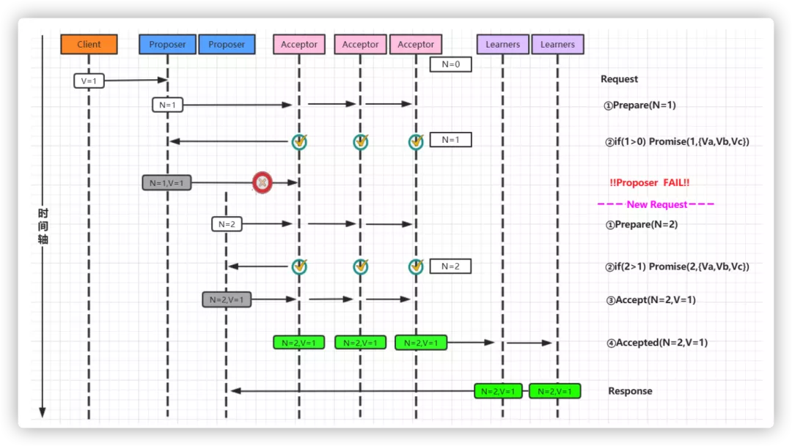
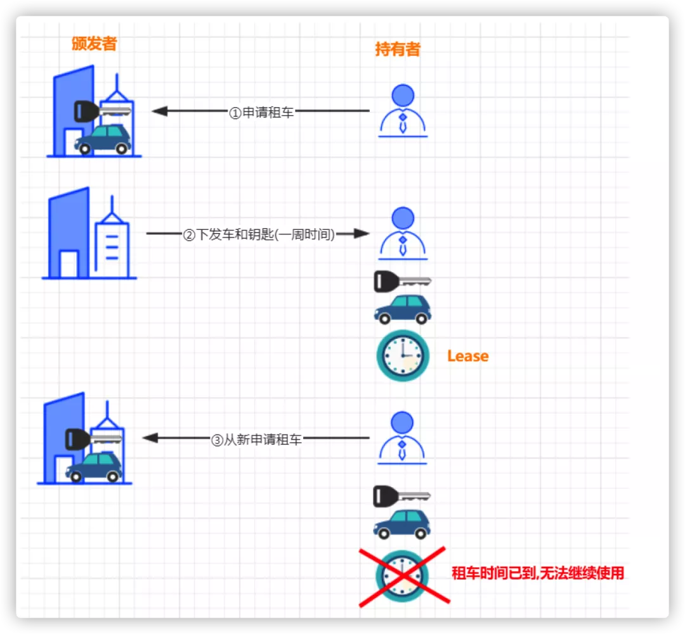
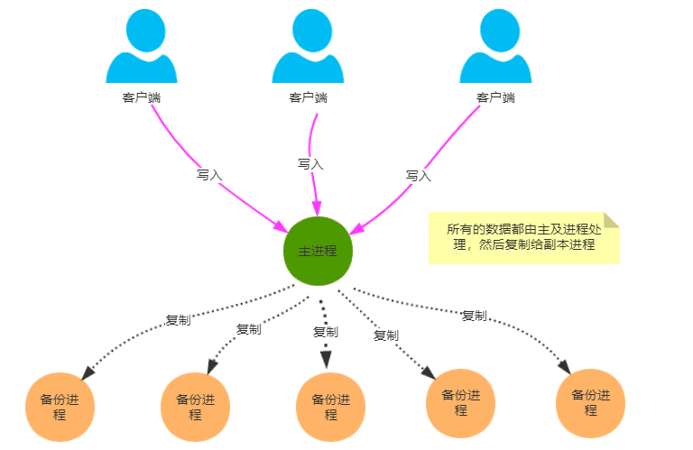

# 分布式系统

分布式系统是一个硬件或软件组件分布在不同的网络计算机上，彼此之间仅仅通过消息传递进行通信和协调的系统。简单来说就是**一群独立计算机集合共同对外提供服务，但是对于系统的用户来说，就像是一台计算机在提供服务一样**。

------

##  特征

### **分布性**

分布式系统中的多台计算机之间在空间位置上可以随意分布，同时，机器的分布情况也会随时变动。

### **对等性**

分布式系统中的计算机没有主／从之分，即没有控制整个系统的主机，也没有被控制的从机，组成分布式系统的所有计算机节点都是对等的。副本（Replica）是分布式系统最常见的概念之一，指的是分布式系统对数据和服务提供的一种冗余方式。在常见的分布式系统中，为了对外提供高可用的服务，我们往往会对数据和服务进行副本处理。数据副本是指在不同节点上持久化同一份数据，当某一个节点上存储的数据丢失时，可以从副本上读取该数据，这是解决分布式系统数据丢失问题最为有效的手段。另一类副本是服务副本，指多个节点提供同样的服务，每个节点都有能力接收来自外部的请求并进行相应的处理。

### **自治性**

分布式系统中的各个节点都包含自己的处理机和内存，各自具有独立的处理数据的功能。通常，彼此在地位上是平等的，无主次之分，既能自治地进行工作，又能利用共享的通信线路来传送信息，协调任务处理。

### **并发性**

在一个计算机网络中，程序运行过程的并发性操作是非常常见的行为。例如同一个分布式系统中的多个节点，可能会并发地操作一些共享的资源，如何准确并高效地协调分布式并发操作也成为了分布式系统架构与设计中最大的挑战之一。

## 分布式系统面临的问题

### **缺乏全局时钟**

在分布式系统中，很难定义两个事件究竟谁先谁后，原因就是因为分布式系统缺乏一个全局的时钟序列控制。

### **机器宕机**

机器宕机是最常见的异常之一。在大型集群中每日宕机发生的概率为千分之一左右，在实践中，一台宕机的机器恢复的时间通常认为是24 小时，一般需要人工介入重启机器。

### **网络异常**

消息丢失，两片节点之间彼此完全无法通信，即出现了“网络分化”；消息乱序，有一定的概率不是按照发送时的顺序依次到达目的节点，考虑使用序列号等机制处理网络消息的乱序问题，使得无效的、过期的网络消息不影响系统的正确性；数据错误；不可靠的TCP，TCP 协议为应用层提供了可靠的、面向连接的传输服务，但在分布式系统的协议设计中不能认为所有网络通信都基于TCP 协议则通信就是可靠的。TCP协议只能保证同一个TCP 链接内的网络消息不乱序，TCP 链接之间的网络消息顺序则无法保证。

### **分布式三态**

如果某个节点向另一个节点发起RPC(Remote procedure call)调用，即某个节点A 向另一个节点B 发送一个消息，节点B 根据收到的消息内容完成某些操作，并将操作的结果通过另一个消息返回给节点A，那么这个RPC 执行的结果有三种状态：“成功”、“失败”、“超时（未知）”，称之为分布式系统的三态。

### **存储数据丢失**

对于有状态节点来说，数据丢失意味着状态丢失，通常只能从其他节点读取、恢复存储的状态。 *异常处理原则*：被大量工程实践所检验过的异常处理黄金原则是：任何在设计阶段考虑到的异常情况一定会在系统实际运行中发生，但在系统实际运行遇到的异常却很有可能在设计时未能考虑，所以，除非需求指标允许，在系统设计时不能放过任何异常情况。

------

# CAP理论

### 一致性（ C ）

CAP 理论中的一致性是指强一致性（ Strong Consistency ），又叫线性一致性（ Linearizable Consistency ），它要求多节点组成的分布式系统，能像单节点一样运作，如果一个写操作返回成功，那么之后的读请求都必须读到这个新数据；如果返回失败，那么所有的读操作都不能读到这个数据。

一致性中除了强一致性之外，还有其他的一致性级别，比如序列一致性（ Sequential Consistency ）和最终一致性（ Eventual Consistency ）等，这个在后面的课程“一致性与共识（一）”中会有详细的介绍。

### 可用性（ A ）

CAP 理论对可用性的定义，指的是要求系统提供的服务必须处于 100% 可用的状态，对于用户的每一个操作请求，系统总能够在有限的时间内返回结果。

### 分区容错性（ P ）

分区指的是在整个分布式系统中，因为各种网络原因，系统被分隔成多个单独的部分，它不仅包含我们通常说的网络分区，也包含因为网络丢包导致的网络不通的情况。并且，这里说的因为网络丢包导致网络不通的情形，还包含节点宕机的场景，由于系统的其他机器不知道某个节点宕机了，只知道与宕机节点的网络是不通的，所以当节点宕机发生时，其他节点发往宕机节点的包也将丢失。

# 一致性理论

分布式系统当中，数据往往会有**多个副本**。如果是一台数据库处理所有的数据请求，那么通过ACID四原则，基本可以保证数据的一致性。而多个副本就需要保证数据会有多份拷贝。这就带来了**同步**的问题，因为我们几乎**没有办法保证**可以**同时更新**所有机器当中的包括备份所有数据。 **网络延迟**，即使我在同一时间给所有机器发送了更新数据的请求，也不能保证这些请求被响应的时间保持一致存在时间差，就会存在某些机器之间的数据不一致的情况。

我们**无法找到一种能够满足分布式系统所有系统属性的分布式一致性解决方案**。因此，如何既保证数据的一致性，同时又不影响系统运行的性能，是每一个分布式系统都需要重点考虑和权衡的。

## 一致性分类

### 1、强一致性

这种一致性级别是最符合用户直觉的，它要求系统写入什么，读出来的也会是什么，用户体验好，但实现起来往往

对系统的性能影响大。但是强一致性很难实现。

### 2、弱一致性

这种一致性级别约束了系统在写入成功后，不承诺立即可以读到写入的值，也不承诺多久之后数据能够达到一致，

但会尽可能地保证到某个时间级别（比如秒级别）后，数据能够达到一致状态。

### 3、读写一致性

- 用户读取自己写入结果的一致性，保证用户永远能够第一时间看到自己更新的内容。 
- 比如我们发一条朋友圈，朋友圈的内容是不是第一时间被朋友看见不重要，但是一定要显示在自己的列表上. 

#### 解决方案

- 方案1：一种方案是对于一些特定的内容我们每次都去主库读取。 （问题主库压力大） 
- 方案2：我们设置一个更新时间窗口，在刚刚更新的一段时间内，我们默认都从主库读取，过了这个窗口之后，我们会挑选最近有过更新的从库进行读取 
- 方案3：我们直接记录用户更新的时间戳，在请求的时候把这个时间戳带上，凡是最后更新时间小于这个时间戳的从库都不予以响应。

### 4、单调读一致性

- 本次读到的数据不能比上次读到的旧。 

由于主从节点更新数据的时间不一致，导致用户在不停地刷新的时候，有时候能刷出来，再次刷新之后会发现数据不见了，再刷新又可能再刷出来，就好像遇见灵异事件一样 

#### 解决方案

根据用户ID计算一个hash值，再通过hash值映射到机器。同一个用户不管怎么刷新，都只会被映射到同一台机器上。这样就保证了不会读到其他从库的内容，带来用户体验不好的影响。

### 5、因果一致性

如果节点 A 在更新完某个数据后通知了节点 B，那么节点 B 之后对该数据的访问和修改都是基于 A 更新后的值。于 此同时，和节点 A 无因果关系的节点 C 的数据访问则没有这样的限制。

### 6、最终一致性

最终一致性是所有分布式一致性模型当中最弱的。可以认为是没有任何优化的**“最”弱一致性**，它的意思是说，我不考虑所有的中间 状态的影响，只保证当没有新的更新之后，经过一段时间之后，最终系统内所有副本的数据是正确的。 

它最大程度上保证了系统的**并发能力**，也因此，在高并发的场景下，它也是**使用最广的一致性模型**。

# BASE理论

### 基本可用（Basically Available）

当系统发生不可预知的故障时，允许损失部分可用性。

- 响应时间的损失：原先0.5s就能返回的结果，允许2s内返回
- 系统功能的损失：可以损失非核心功能，而保证核心功能的可用

### 软状态（Soft State）

允许存在中间状态，允许在多个节点的数据副本存在时延

### 最终一致性（Eventually Consistent）

在一个时间期限后，要保证数据的最终一致性

# 分布式一致性协议

### 3.1 两阶段提交协议(2PC)

#### 3.1.1两阶段提交协议

两阶段提交协议，简称2PC(2 Prepare Commit)，是比较常用的**解决分布式事务问题的方式**，要么所有参与进程都提交事务，要么都取消事务，即实现ACID中的原子性(A)的常用手段。

分布式事务: 事务提供一种操作本地数据库的不可分割的一系列操作 “要么什么都不做，要么做全套（All or Nothing）”的机制,而分布式事务就是为了操作不同数据库的不可分割的一系列操作 “要么什么都不做，要么做全套（All or Nothing）”的机制

#### 3.1.2 2PC执行流程

##### 1. 成功执行事务事务提交流程

**阶段一:**

1. 事务询问：协调者向所有的参与者发送事务内容，询问是否可以执行事务提交操作，并开始等待各参与者的响应。
2. 执行事务 (写本地的Undo/Redo日志)
3. 各参与者向协调者反馈事务询问的响应

**阶段二:**

1. 发送提交请求：协调者向所有参与者发出 commit 请求。
2. 事务提交：参与者收到 commit 请求后，会正式执行事务提交操作，并在完成提交之后释放整个事务执行期间占用的事务资源。
3. 反馈事务提交结果：参与者在完成事务提交之后，向协调者发送 Ack 信息。
4. 完成事务：协调者接收到所有参与者反馈的 Ack 信息后，完成事务。

##### 2. 中断事务流程

假如任何一个参与者向协调者反馈了No响应，或者在等待超时之后，协调者尚无法接收到所有参与者的反馈响应，那么就会中断事务

**阶段一:**

事务询问：协调者向所有的参与者发送事务内容，询问是否可以执行事务提交操作，并开始等待各参与者的响应。

执行事务 (写本地的Undo/Redo日志)

各参与者向协调者反馈事务询问的响应

阶段二:

发送回滚请求：协调者向所有参与者发出 Rollback 请求。

事务回滚：参与者接收到 Rollback 请求后，会利用其在阶段一中记录的 Undo 信息来执行事务回滚操作，并在完成回滚之后释放在整个事务执行期间占用的资源。

反馈事务回滚结果：参与者在完成事务回滚之后，向协调者发送 Ack 信息。

中断事务：协调者接收到所有参与者反馈的 Ack 信息后，完成事务中断。

#### 3.1.3 2PC 优点缺点

1. 优点

原理简单

1. 缺点

同步阻塞：在二阶段提交的执行过程中，所有参与该事务操作的逻辑都处于阻塞状态，即当参与者占有公共资源时，其他节点访问公共资源会处于阻塞状态

单点问题：若协调器出现问题，那么整个二阶段提交流程将无法运转，若协调者是在阶段二中出现问题时，那么其他参与者将会一直处于锁定事务资源的状态中，而无法继续完成事务操作

数据不一致：在阶段二中，执行事务提交的时候，当协调者向所有的参与者发送Commit请求之后，发生了局部网络异常或者是协调者在尚未发送完Commit请求之前自身发生了崩溃，导致最终只有部分参与者收到了Commit请求，于是会出现数据不一致的现象。

太过保守：在进行事务提交询问的过程中，参与者出现故障而导致协调者始终无法获取到所有参与者的响应信息的话，此时协调者只能依靠自身的超时机制来判断是否需要中断事务，这样的策略过于保守，即没有完善的容错机制，**任意一个结点的失败都会导致整个事务的失败**。

### 3.2 三阶段提交协议(3PC)

三阶段提交协议出现背景：一致性协议中设计出了二阶段提交协议（2PC），但是2PC设计中还存在缺陷，于是就有了三阶段提交协议，这便是3PC的诞生背景。

3.2.1 三阶段提交协议

3PC，全称 “three phase commit”，是 2PC 的改进版，将 2PC 的 “提交事务请求” 过程一分为二，共形成了由CanCommit、PreCommit和doCommit三个阶段组成的事务处理协议。

三阶段提交升级点（基于二阶段）：

- 三阶段提交协议引入了超时机制。
- 在第一阶段和第二阶段中，引入了一个准备阶段。保证了在最后提交阶段之前各参与节点的状态是一致的。

简单讲：就是除了引入超时机制之外，3PC把2PC的准备阶段再次一分为二，这样三阶段提交就有CanCommit、PreCommit、DoCommit三个阶段。

#### 3.2.2 三个阶段详解

##### 1. 第一阶段（CanCommit 阶段）

类似于2PC的准备（第一）阶段。协调者向参与者发送commit请求，参与者如果可以提交就返回Yes响应，否则返回No响应。

事务询问：协调者向参与者发送CanCommit请求。询问是否可以执行事务提交操作。然后开始等待参与者的响应。

响应反馈：参与者接到CanCommit请求之后，正常情况下， 如果其自身认为可以顺利执行事务，则返回Yes响应，并进入预备状态。否则 反馈No

##### 2. 第二阶段（PreCommit 阶段)

协调者根据参与者的反应情况来决定是否可以执行事务的PreCommit操作。根据响应情况，有以下两种可能。

Yes

(1).发送预提交请求：协调者向参与者发送PreCommit请求，并进入Prepared阶段。

(2).事务预提交: 参与者接收到PreCommit请求后，会执行事务操作，并将undo和redo信息记录到事务日志中。

(3).响应反馈: 如果参与者成功的执行了事务操作，则返回ACK响应，同时开始等待最终指令。

No

假如有任何一个参与者向协调者发送了No响应，或者等待超时之后，协调者都没有接到参与者的响应，那么就执行事务的中断。则有：

(1).发送中断请求：协调者向所有参与者发送abort请求。

(2).中断事务: 参与者收到来自协调者的abort请求之后（或超时之后，仍未收到协调者的请求），执行事务的中断

##### 3. 第三阶段（doCommit 阶段）

该阶段进行真正的事务提交，也可以分为执行提交和中断事务两种情况。

执行成功

(1).发送提交请求: 协调者接收到参与者发送的ACK响应，那么它将从预提交状态进入到提交状态。并向所有参与者发送doCommit请求。

(2).事务提交: 参与者接收到doCommit请求之后，执行正式的事务提交。并在完成事务提交之后释放所有事务资源。

(3).响应反馈: 事务提交完之后，向协调者发送ACK响应。

(4).完成事务: 协调者接收到所有参与者的ACK响应之后，完成事务。

中断事务

(1).发送中断请求: 协调者向所有参与者发送abort请求

(2).事务回滚: 参与者接收到abort请求之后，利用其在阶段二记录的undo信息来执行事务的回滚操作， 并在完成回滚之后释放所有的事务资源。

(3).反馈结果: 参与者完成事务回滚之后，向协调者发送ACK消息

(4).中断事务: 协调者接收到所有参与者反馈的ACK消息之后，执行事务的中断。

**注意：**

一旦进入阶段三，可能会出现 2 种故障：

协调者出现问题

协调者和参与者之间的网络故障

如果出现了任一一种情况，最终都会导致参与者无法收到 doCommit 请求或者 abort 请求，针对这种情况，参与者都会在等待超时之后，继续进行事务提交

#### 3.2.3 2PC对比3PC

1. 首先对于协调者和参与者都设置了超时机制（在2PC中，只有协调者拥有超时机制，即如果在一定时间内没有收到参与者的消息则默认失败）,主要是避免了参与者在长时间无法与协调者节点通讯（协调者挂掉了）的情况下，无法释放资源的问题，因为参与者自身拥有超时机制会在超时后，自动进行本地commit从而进行释放资源。而这种机制也侧面降低了整个事务的阻塞时间和范围。
2. 通过CanCommit、PreCommit、DoCommit三个阶段的设计，相较于2PC而言，多设置了一个缓冲阶段保证了在最后提交阶段之前各参与节点的状态是一致的 。
3. PreCommit是一个缓冲，保证了在最后提交阶段之前各参与节点的状态是一致的。

**问题：3PC协议并没有完全解决数据一致问题。**

### 3.3 NWR协议

#### 3.3.1 什么是NWR协议

NWR是一种在分布式存储系统中用于控制一致性级别的一种策略。在亚马逊的云存储系统中，就应用NWR来控制一致性。

N：在分布式存储系统中，有多少份备份数据

W：代表一次成功的更新操作要求至少有w份数据写入成功

R：代表一次成功的读数据操作要求至少有R份数据成功读取

#### 3.3.2 原理

NWR值的不同组合会产生不同的一致性效果，当W+R>N的时候，整个系统对于客户端来讲能保证强一致性。以常见的N=3、W=2、R=2为例:

N=3，表示，任何一个对象都必须有三个副本

W=2表示，对数据的修改操作只需要在3个副本中的2个上面完成就返回

R=2表示，从三个对象中要读取到2个数据对象，才能返回

在分布式系统中，数据的单点是不允许存在的。即线上正常存在的备份数量N设置1的情况是非常危险的，因为一旦这个备份发生错误，就 可能发生数据的永久性错误。假如把N设置成为2，那么，只要有一个存储节点发生损坏，就会有单点的存在。所以N必须大于2。N越高，系统的维护和整体 成本就越高。工业界通常把N设置为3。

1. 当W是2、R是2的时候，W+R>N，这种情况对于客户端就是强一致性的。

在上图中，如果R+W>N,则读取操作和写入操作成功的数据一定会有交集（如图中的Node2），这样就可以保证一定能够读取到最新版本的更新数据，数据的强一致性得到了保证。在满足数据一致性协议的前提下，R或者W设置的越大，则系统延迟越大，因为这取决于最慢的那份备份数据的响应时间。

1. 当R+W<=N，无法保证数据的强一致性

因为成功写和成功读集合可能不存在交集，这样读操作无法读取到最新的更新数值，也就无法保证数据的强一致性。

### 3.4 Gossip 协议

#### 3.4.1 什么是Gossip 协议

Gossip 协议也叫 Epidemic 协议 （流行病协议）。原本用于分布式数据库中节点同步数据使用，后被广泛用于数据库复制、信息扩散、集群成员身份确认、故障探测等。

从 gossip 单词就可以看到，其中文意思是八卦、流言等意思，可以想象下绯闻的传播（或者流行病的传播）；gossip 协议的工作原理就类似于这个。gossip 协议利用一种随机的方式将信息传播到整个网络中，并在一定时间内使得系统内的所有节点数据一致。Gossip 其实是一种去中心化思路的分布式协议，解决状态在集群中的传播和状态一致性的保证两个问题。

#### 3.4.2 Gossip原理

Gossip 协议的消息传播方式有两种：反熵传播 和 谣言传播

1. 反熵传播

是以固定的概率传播所有的数据。所有参与节点只有两种状态：Suspective(病原)、Infective(感染)。过程是种子节点会**把所有的数据都跟其他节点共享**，以便消除节点之间数据的任何不一致，它可以保证最终、完全的一致。缺点是消息数量非常庞大，且无限制；**通常只用于新加入节点的数据初始化**。

1. 谣言传播

是以固定的概率仅传播新到达的数据。所有参与节点有三种状态：Suspective(病原)、Infective(感染)、Removed(愈除)。过程是**消息只包含最新 update**，谣言消息在某个时间点之后会被标记为 removed，并且不再被传播。缺点是系统有一定的概率会不一致，**通常用于节点间数据增量同步**。

#### 3.4.3 通信方式

Gossip 协议最终目的是将数据分发到网络中的每一个节点。**根据不同的具体应用场景，网络中两个节点之间存在三种通信方式：推送模式、拉取模式、推/拉模式**

1. Push

节点 A 将数据 (key,value,version) 及对应的版本号推送给 B 节点，B 节点更新 A 中比自己新的数据

1. Pull

A 仅将数据 key, version 推送给 B，B 将本地比 A 新的数据（Key, value, version）推送给 A，A 更新本地

1. Push/Pull

与 Pull 类似，只是多了一步，A 再将本地比 B 新的数据推送给 B，B 则更新本地

#### 3.4.4 优缺点

综上所述，可以得出 Gossip 是一种去中心化的分布式协议，数据通过节点像病毒一样逐个传播。因为是指数级传播，整体传播速度非常快。

1. 优点

扩展性：允许节点的任意增加和减少，新增节点的状态 最终会与其他节点一致

容错：任意节点的宕机和重启都不会影响 Gossip 消息的传播，具有天然的分布式系统容错特性

去中心化：无需中心节点，所有节点都是对等的，任意节点无需知道整个网络状况，只要网络连通，任意节点可把消息散播到全网

最终一致性：Gossip 协议实现信息指数级的快速传播，因此在有新信息需要传播时，消息可以快速地发送到全局节点，在有限的时间内能够做到所有节点都拥有最新的数据。

1. 缺点

消息延迟:节点随机向少数几个节点发送消息，消息最终是通过多个轮次的散播而到达全网；不可避免的造成消息延迟。

消息冗余:节点定期随机选择周围节点发送消息，而收到消息的节点也会重复该步骤；不可避免的引起同一节点消息多次接收，增加消息处理压力

Gossip 协议由于以上的优缺点，所以适合于 AP 场景的数据一致性处理，常见应用有：P2P 网络通信、Redis Cluster、Consul。

### 3.5 Paxos协议

#### 3.5.1 什么是Paxos

Paxos协议其实说的就是Paxos算法, **Paxos算法是基于消息传递且具有高度容错特性的一致性算法**，是目前公认的解决分布式一致性问题最有效的算法之一。

Paxos由 莱斯利·兰伯特(Leslie Lamport)于1998年在《The Part-Time Parliament》论文中首次公开，最初的描述使用希腊的一个小岛Paxos，描述了Paxos小岛中通过决议的流程，并以此命名这个算法，但是这个描述理解起来比较有挑战性。后来在2001年，莱斯利·兰伯特重新发表了朴实的算法描述版本《Paxos Made Simple》自Paxos问世以来就持续垄断了分布式一致性算法，Paxos这个名词几乎等同于分布式一致性。

Google的很多大型分布式系统都采用了Paxos算法来解决分布式一致性问题，如Chubby、Megastore以及Spanner等。开源的ZooKeeper，以及MySQL 5.7推出的用来取代传统的主从复制的MySQL GroupReplication等纷纷采用Paxos算法解决分布式一致性问题。然而，Paxos的最大特点就是难，不仅难以理解，更难以实现。

Google Chubby的作者Mike Burrows说过这个世界上只有一种一致性算法，那就是Paxos，其它的算法都是残次品

#### 3.5.2 Paxos 解决了什么问题

在常见的分布式系统中，总会发生诸如机器宕机或网络异常（包括消息的延迟、丢失、重复、乱序，还有网络分区）等情况。Paxos算法需要解决的问题就是如何在一个可能发生上述异常的分布式系统中，快速且正确地在集群内部对某个数据的值达成一致，并且保证不论发生以上任何异常，都不会破坏整个系统的一致性。

注：这里某个数据的值并不只是狭义上的某个数，它可以是一条日志，也可以是一条命令（command）。。。根据应用场景不同，某个数据的值有不同的含义。

在之前讲解2PC 和 3PC的时候在一定程度上是可以解决数据一致性问题的. 但是并没有完全解决就是协调者宕机的情况.

如何解决2PC和3PC的存在的问题呢?

1. 步骤1-引入多个协调者

1. 步骤-引入主协调者,以他的命令为基准

其实在引入多个协调者之后又引入主协调者.那么这个就是最简单的一种Paxos 算法.

Paxos的版本有: Basic Paxos , Multi Paxos, Fast-Paxos, 具体落地有Raft 和zk的ZAB协议

#### 3.5.3 Basic Paxos相关概念

1. 角色介绍

Client:客户端

客户端向分布式系统发出请求，并等待响应。例如，对分布式文件服务器中文件的写请求。

Proposer：提案发起者

提案者提倡客户端请求，试图说服Acceptor对此达成一致，并在发生冲突时充当协调者以推动协议向前发展

Acceptor: 决策者，可以批准提案

Acceptor可以接受（accept）提案；并进行投票, 投票结果是否通过以多数派为准, 以如果某个提案被选定，那么该提案里的value就被选定了

Learner: 最终决策的学习者

学习者充当该协议的复制因素(不参与投票)

1. 决策模型

1. basic paxos流程

basic paxos流程一共分为4个步骤:

Prepare

Proposer提出一个提案,编号为N, 此N大于这个Proposer之前提出所有提出的编号, 请求Accpetor的多数人接受这个提案

Promise

如果编号N大于此Accpetor之前接收的任提案编号则接收, 否则拒绝

Accept

如果达到多数派, Proposer会发出accept请求, 此请求包含提案编号和对应的内容

Accepted

如果此Accpetor在此期间没有接受到任何大于N的提案,则接收此提案内容, 否则忽略

#### 3.5.4 Basic Paxos流程图

1. 无故障的basic Paxos

1. Acceptor失败时的basic Paxos

在下图中，多数派中的一个Acceptor发生故障，因此多数派大小变为2。在这种情况下，BasicPaxos协议仍然成功。

1. Proposer失败时的basic Paxos

Proposer在提出提案之后但在达成协议之前失败。具体来说，传递到Acceptor的时候失败了,这个时候需要选出新的Proposer（提案人）,那么 Basic Paxos协议仍然成功

1. 当多个提议者发生冲突时的basic Paxos

最复杂的情况是多个Proposer都进行提案,导致Paxos的活锁问题.

**针对活锁问题解决起来非常简单: 只需要在每个Proposer再去提案的时候随机加上一个等待时间即可**

#### 3.5.5 Multi-Paxos流程图

针对basic Paxos是存在一定得问题,首先就是流程复杂,实现及其困难, 其次效率低(达成一致性需要2轮RPC调用),针对basic Paxos流程进行拆分为选举和复制的过程

1. 第一次流程-确定Leader

1. 第二次流程-直接由Leader确认

#### 3.5.5 Multi-Paxos角色重叠流程图

Multi-Paxos在实施的时候会将Proposer，Acceptor和Learner的角色合并统称为“服务器”。因此，最后只有“客户端”和“服务器”。

### 3.6 Raft协议

#### 3.6.1 什么是Raft协议

Paxos 是论证了一致性协议的可行性，但是论证的过程据说晦涩难懂，缺少必要的实现细节，而且工程实现难度比较高, 广为人知实现只有 zk 的实现 zab 协议。

Paxos协议的出现为分布式强一致性提供了很好的理论基础，但是Paxos协议理解起来较为困难，实现比较复杂。然后斯坦福大学RamCloud项目中提出了易实现，易理解的分布式一致性复制协议 Raft。Java，C++，Go 等都有其对应的实现，之后出现的Raft相对要简洁很多。引入主节点，通过竞选确定主节点。节点类型：Follower、Candidate 和 Leader。Leader 会周期性的发送心跳包给 Follower。每个 Follower 都设置了一个随机的竞选超时时间，一般为 150ms~300ms，如果在这个时间内没有收到 Leader 的心跳包，就会变成 Candidate，进入竞选阶段, 通过竞选阶段的投票多的人成为Leader

#### 3.6.2 Raft相关概念

1. 节点状态

Leader（主节点）：接受 client 更新请求，写入本地后，然后同步到其他副本中

Follower（从节点）：从 Leader 中接受更新请求，然后写入本地日志文件。对客户端提供读请求

Candidate（候选节点）：如果 follower 在一段时间内未收到 leader 心跳。则判断 leader可能故障，发起选主提议。节点状态从 Follower 变为 Candidate 状态，直到选主结束

1. termId：任期号，时间被划分成一个个任期，每次选举后都会产生一个新的 termId，一个任期内只有一个 leader。
2. RequestVote：请求投票，candidate 在选举过程中发起，收到多数派响应后，成为 leader。

#### 3.6.3 竞选阶段流程

这个是Raft完整版http://thesecretlivesofdata.com/raft/动画演示

github也提供一个https://raft.github.io/动画演示地址 . 原理都是一样的.

**单节点是不存在数据不一致问题的. 一个节点就很容易就该值达成一致性**

**如果是多个节点如何达成一致性.Raft是用于实施分布式数据一致性协议的**

使用了3个不同的圆圈表示三种不同的状态

接下来开始完成整个竞选阶段流程:

1. 下图表示一个分布式系统的最初阶段，此时只有 Follower，没有 Leader。Follower A 等待一个随机的竞选超时时间之后，没收到 Leader 发来的心跳包，因此进入竞选阶段。

1. 此时 A 发送投票请求给其它所有节点。

1. 其它节点会对请求进行回复，如果超过一半的节点回复了，那么该 Candidate 就会变成 Leader。

1. 之后 Leader 会周期性地发送心跳包给 Follower，Follower 接收到心跳包，会重新开始计时。

#### 3.6.4 Leader节点宕机

此时超时的从节点就会转变为candidate节点，重新开始新的选举

#### 3.6.5 多个 Candidate 竞选

1. 如果有多个 Follower 成为 Candidate，并且所获得票数相同，那么就需要重新开始投票，例如下图中 Candidate B 和 Candidate D 都获得两票，因此需要重新开始投票。

1. 当重新开始投票时，由于每个节点设置的随机竞选超时时间不同，因此能下一次再次出现多个Candidate 并获得同样票数的概率很低

#### 3.6.6 日志复制

1. 来自客户端的修改都会被传入 Leader。注意该修改还未被提交，只是写入日志中。

1. Leader 会把修改复制到所有 Follower。

3. Leader 会等待大多数的 Follower 也进行了修改，然后才将修改提交。

1. 此时 Leader 会通知的所有 Follower 让它们也提交修改，此时所有节点的值达成一致。
2. 多次日志复制情况

#### 3.6.7 网络分区

面对网络分区，Raft甚至可以保持一致。

1. 最初始正常情况下状态,B节点会对其他4个节点发送心跳

2. 当出现网络分区情况, 但是出现网络分区的请求后,只能对A发送心跳,同时其他三个节点会再次选出一个leader节点

#### 3.6.8 网络分区情况日志复制

网络分区情况日志复制工作也可以完成数据一致性

1. 不同分区写入数据不同

2. 最终E节点Termid最大成为Leader节点,同步节点数据,达成数据一致性

**网络分区恢复以后，以term大的leader节点为leader节点**

### 3.7 Lease机制

#### 3.7.1 什么是Lease机制

Lease机制，翻译过来即是租约机制，是一种在分布式系统常用的协议，是维护分布式系统数据一致性的一种常用工具。

Lease机制有以下几个特点：

Lease是颁发者对一段时间内数据一致性的承诺；

颁发者发出Lease后，不管是否被接收，只要Lease不过期，颁发者都会按照协议遵守承诺；

Lease的持有者只能在Lease的有效期内使用承诺，一旦Lease超时，持有者需要放弃执行，重新申请Lease。

以租车为例:

#### 3.7.2 Lease机制解决了什么问题

分布式系统中，如何确认一个节点是否工作正常？如果有5副本1-5。其中1号为主副本

在分布式中最直观的处理方法是在每个副本与主副本维护一个心跳，期望通过心跳是否存在而判断对方是否依旧存活。

心跳方法其实根本无法解决分布式下节点是否正常的这个的这个问题。考虑如下场景：

1. 在某个时刻Node1主节点突然出现网络抖动或者网络中断情况(注意:不是宕机),导致从节点无法接受到心跳.

1. 会在剩下的副节点中选取一当主节点.

主要解决思路有四种：

- 设计能容忍双主的分布式协议
- Raft协议-通过Term版本高的同步低的.
- 用lease机制
- 涉及去中心化-Gossip协议

#### 3.7.2 Lease的原理

1. 引入中心节点负责下发Lease

1. 出现网络问题

在01:05期间如果出现网络抖动导致其他节点申请Lease会申请失败, 因为中心节点在01:10之前都会承认有主节点,不允许其他节点在申请Lease

1. 如果网络恢复

1. 如果到01:10时间,主节点会进行续约操作,然后在下发新的Lease

1. 如果主节点宕机,其他节点申请Lease也会失败,承认主节点存在

1. 副节点申请Lease,申请成功. 因为Lease过期

#### 3.7.3 lease的容错

1. 主节点宕机

lease机制天生即可容忍网络、lease接收方的出错,时间即Lease剩余过期时长

1. 中心节点异常

颁发者宕机可能使得全部节点没有lease，系统处于不可用状态，解决的方法就是使用一个小集群而不是单一节点作为颁发者。

1. 时差问题

中心节点与主节点之间的时钟可能也存在误差，只需要中心节点考虑时钟误差即可。

lease时间长短一般取经验值1-10秒即可。太短网络压力大，太长则收回承诺时间过长影响可用性。

#### 3.7.4 应用

1. GFS(Google 文件系统)中，Master通过lease机制决定哪个是主副本，lease在给各节点的心跳响应消息中携带。收不到心跳时，则等待lease过期，再颁发给其他节点。
2. chubby中，paxos选主后，从节点会给主颁发lease，在期限内不选其他节点为主。另一方面，主节点给每个client节点发送lease，用于判断client存活。

### ZAB协议

> ZAB 协议全称：Zookeeper Atomic Broadcast（Zookeeper 原子广播协议）。

1. Zookeeper 是一个为分布式应用提供高效且可靠的分布式协调服务。在解决分布式一致性方面，Zookeeper 并没有使用 Paxos ，而是采用了 ZAB 协议。
2. ZAB 协议定义：**ZAB 协议是为分布式协调服务 Zookeeper 专门设计的一种支持 `崩溃恢复` 和 `原子广播` 协议**。下面我们会重点讲这两个东西。
3. 基于该协议，Zookeeper 实现了一种 主备模式 的系统架构来保持集群中各个副本之间数据一致性。具体如下图所示：

上图显示了 Zookeeper 如何处理集群中的数据。所有客户端写入数据都是写入到 主进程（称为 Leader）中，然后，由 Leader 复制到备份进程（称为 Follower）中。从而保证数据一致性。从设计上看，和 Raft 类似。

1. 那么复制过程又是如何的呢？复制过程类似 2PC，ZAB 只需要 Follower 有一半以上返回 Ack 信息就可以执行提交，大大减小了同步阻塞。也提高了可用性。

简单介绍完，开始重点介绍 `消息广播` 和 `崩溃恢复`。**整个 Zookeeper 就是在这两个模式之间切换**。 简而言之，当 Leader 服务可以正常使用，就进入消息广播模式，当 Leader 不可用时，则进入崩溃恢复模式。

### 消息广播

ZAB 协议的消息广播过程使用的是一个原子广播协议，类似一个 二阶段提交过程。对于客户端发送的写请求，全部由 Leader 接收，Leader 将请求封装成一个事务 Proposal，将其发送给所有 Follwer ，然后，根据所有 Follwer 的反馈，如果超过半数成功响应，则执行 commit 操作（先提交自己，再发送 commit 给所有 Follwer）。

基本上，整个广播流程分为 3 步骤：

1.将数据都复制到 Follwer 中

等待 Follwer 回应 Ack，最低超过半数即成功

当超过半数成功回应，则执行 commit ，同时提交自己

通过以上 3 个步骤，就能够保持集群之间数据的一致性。实际上，在 Leader 和 Follwer 之间还有一个消息队列，用来解耦他们之间的耦合，避免同步，实现异步解耦。

还有一些细节：

- Leader 在收到客户端请求之后，会将这个请求封装成一个事务，并给这个事务分配一个全局递增的唯一 ID，称为事务ID（ZXID），ZAB 兮协议需要保证事务的顺序，因此必须将每一个事务按照 ZXID 进行先后排序然后处理。
- 在 Leader 和 Follwer 之间还有一个消息队列，用来解耦他们之间的耦合，解除同步阻塞。
- zookeeper集群中为保证任何所有进程能够有序的顺序执行，只能是 Leader 服务器接受写请求，即使是 Follower 服务器接受到客户端的请求，也会转发到 Leader 服务器进行处理。
- 实际上，这是一种简化版本的 2PC，不能解决单点问题。等会我们会讲述 ZAB 如何解决单点问题（即 Leader 崩溃问题）。

###   崩溃恢复

刚刚我们说消息广播过程中，Leader 崩溃怎么办？还能保证数据一致吗？如果 Leader 先本地提交了，然后 commit 请求没有发送出去，怎么办？

实际上，当 Leader 崩溃，即进入我们开头所说的崩溃恢复模式（崩溃即：Leader 失去与过半 Follwer 的联系）。下面来详细讲述。

- 假设1：Leader 在复制数据给所有 Follwer 之后崩溃，怎么办？
- 假设2：Leader 在收到 Ack 并提交了自己，同时发送了部分 commit 出去之后崩溃怎么办？

针对这些问题，ZAB 定义了 2 个原则：

- ZAB 协议确保那些已经在 Leader 提交的事务最终会被所有服务器提交。
- ZAB 协议确保丢弃那些只在 Leader 提出/复制，但没有提交的事务。

所以，ZAB 设计了下面这样一个选举算法：**能够确保提交已经被 Leader 提交的事务，同时丢弃已经被跳过的事务**。

针对这个要求，如果让 Leader 选举算法能够保证新选举出来的 Leader 服务器拥有集群总所有机器编号（即 ZXID 最大）的事务，那么就能够保证这个新选举出来的 Leader 一定具有所有已经提交的提案。

而且这么做有一个好处是：**可以省去 Leader 服务器检查事务的提交和丢弃工作的这一步操作**。

这样，我们刚刚假设的两个问题便能够解决。假设 1 最终会丢弃调用没有提交的数据，假设 2 最终会同步所有服务器的数据。这个时候，就引出了一个问题，如何同步？

### 数据同步

当崩溃恢复之后，需要在正式工作之前（接收客户端请求），Leader 服务器首先确认事务是否都已经被过半的 Follwer 提交了，即是否完成了数据同步。目的是为了保持数据一致。

当所有的 Follwer 服务器都成功同步之后，Leader 会将这些服务器加入到可用服务器列表中。

实际上，Leader 服务器处理或丢弃事务都是依赖着 ZXID 的，那么这个 ZXID 如何生成呢？

答：在 ZAB 协议的事务编号 ZXID 设计中，ZXID 是一个 64 位的数字，其中低 32 位可以看作是一个简单的递增的计数器，针对客户端的每一个事务请求，Leader 都会产生一个新的事务 Proposal 并对该计数器进行 + 1 操作。

而高 32 位则代表了 Leader 服务器上取出本地日志中最大事务 Proposal 的 ZXID，并从该 ZXID 中解析出对应的 epoch 值，然后再对这个值加一。

高 32 位代表了每代 Leader 的唯一性，低 32 代表了每代 Leader 中事务的唯一性。同时，也能让 Follwer 通过高 32 位识别不同的 Leader。简化了数据恢复流程。

基于这样的策略：当 Follower 链接上 Leader 之后，Leader 服务器会根据自己服务器上最后被提交的 ZXID 和 Follower 上的 ZXID 进行比对，比对结果要么回滚，要么和 Leader 同步。

## 总结

ZAB 协议和我们之前看的 Raft 协议实际上是有相似之处的，比如都有一个 Leader，用来保证一致性（Paxos 并没有使用 Leader 机制保证一致性）。再有采取过半即成功的机制保证服务可用（实际上 Paxos 和 Raft 都是这么做的）。

ZAB 让整个 Zookeeper 集群在两个模式之间转换，消息广播和崩溃恢复，消息广播可以说是一个简化版本的 2PC，通过崩溃恢复解决了 2PC 的单点问题，通过队列解决了 2PC 的同步阻塞问题。

而支持崩溃恢复后数据准确性的就是数据同步了，数据同步基于事务的 ZXID 的唯一性来保证。通过 + 1 操作可以辨别事务的先后顺序。

------

