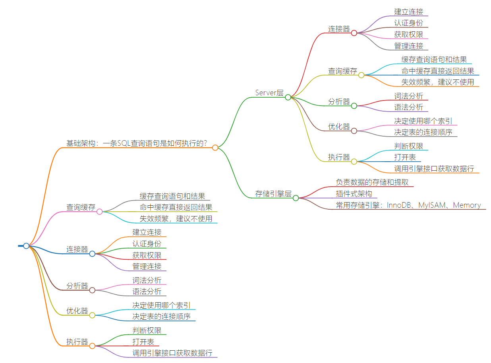
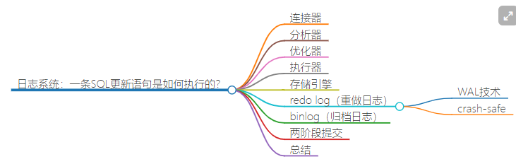
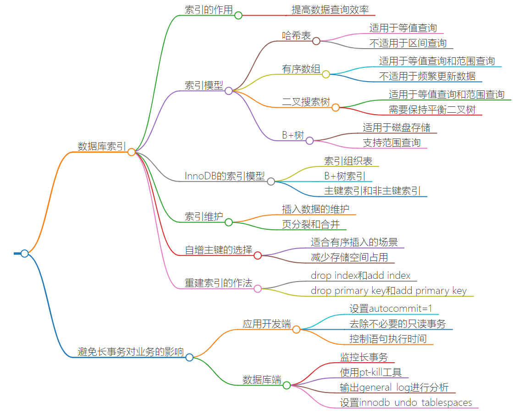
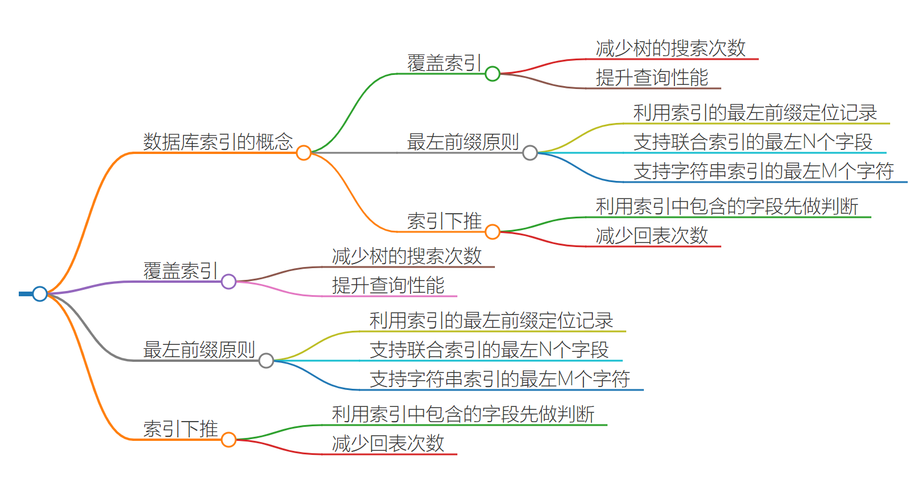
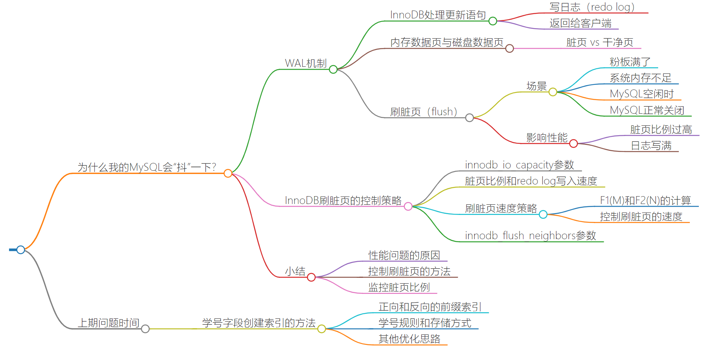
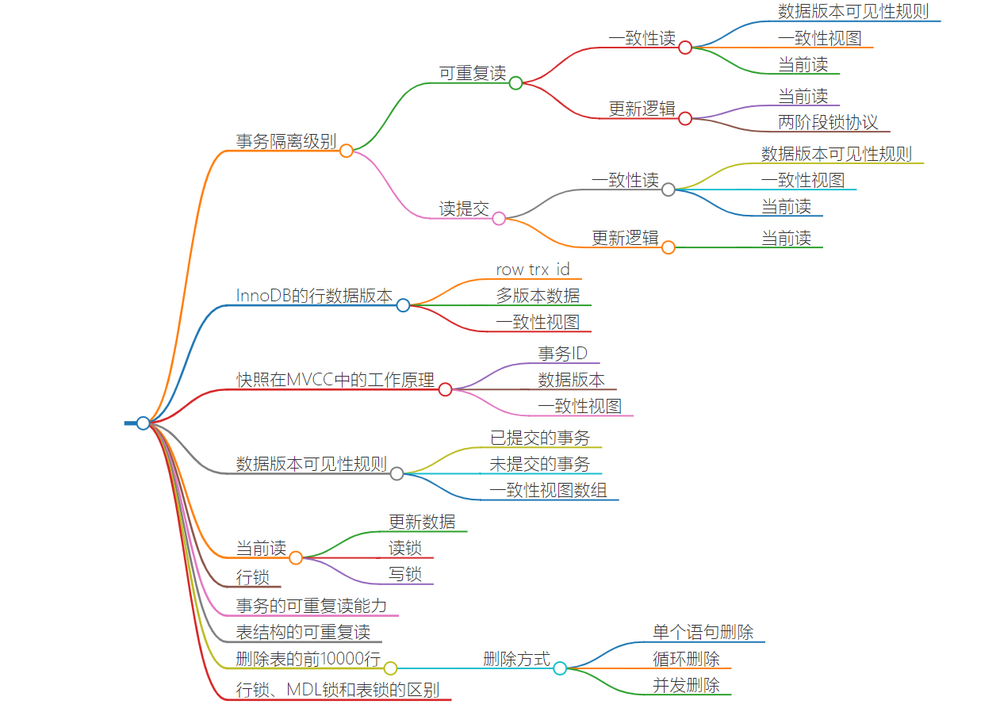

# 基础篇

## 基础架构



如果表 T 中没有字段 k，而你执行了这个语句 select * from T where k=1, 那肯定是会报“不存在这个列”的错误： “Unknown column ‘k’ in ‘where clause’”。你觉得这个错误是在我们上面提到的哪个阶段报出来的呢？

- 分析器。Oracle会在分析阶段判断语句是否正确，表是否存在，列是否存在等。猜测MySQL也这样

## 日志系统



### 一条sql的执行过程


- 首先执行器根据 MySQL 的执行计划来查询数据，先是从缓存池中查询数据，如果没有就会去数据库中查询，如果查询到了就将其放到缓存池中
- 在数据被缓存到缓存池的同时，会写入 undo log 日志文件
- 更新的动作是在 BufferPool 中完成的，同时会将更新后的数据添加到 redo log buffer 中
- 完成以后就可以提交事务，在提交的同时会做以下三件事 
  - 将redo log buffer中的数据刷入到 redo log 文件中
  - 将本次操作记录写入到 bin log文件中
  - 将 bin log 文件名字和更新内容在 bin log 中的位置记录到redo log中，同时在 redo log 最后添加 commit 标记

至此表示整个更新事务已经完成

------

著作权归@pdai所有 原文链接：https://pdai.tech/md/db/sql-mysql/sql-mysql-execute.html

#### 两阶段提交


##### 在两阶段提交的不同时刻，MySQL 异常重启会出现什么现象

- 时刻A：
- 时刻B:


**BinLog、RedoLog、UndoLog**

https://www.yuque.com/fcant/sql/tlxo8c#n93xJ

### 思考题

前面我说到定期全量备份的周期“取决于系统重要性，有的是一天一备，有的是一周一备”。那么在什么场景下，一天一备会比一周一备更有优势呢？或者说，它影响了这个数据库系统的哪个指标？

- 在一天一备的模式里，最坏情况下需要应用一天的 binlog。比如，你每天 0 点做一次全量备份，而要恢复出一个到昨天晚上 23 点的备份。一周一备最坏情况就要应用一周的 binlog 了。系统的对应指标就是 @尼古拉斯·赵四 @慕塔 提到的 RTO（恢复目标时间）。当然这个是有成本的，因为更频繁全量备份需要消耗更多存储空间，所以这个 RTO 是成本换来的，就需要你根据业务重要性来评估了。

你现在知道了系统里面应该避免长事务，如果你是业务开发负责人同时也是数据库负责人，你会有什么方案来避免出现或者处理这种情况呢？

这个问题，我们可以从应用开发端和数据库端来看。

- 首先，从应用开发端来看：
  - 确认是否使用了 set autocommit=0。这个确认工作可以在测试环境中开展，把 MySQL 的 general_log 开起来，然后随便跑一个业务逻辑，通过 general_log 的日志来确认。一般框架如果会设置这个值，也就会提供参数来控制行为，你的目标就是把它改成 1。
  - 确认是否有不必要的只读事务。有些框架会习惯不管什么语句先用 begin/commit 框起来。我见过有些是业务并没有这个需要，但是也把好几个 select 语句放到了事务中。这种只读事务可以去掉。
  - 业务连接数据库的时候，根据业务本身的预估，通过 SET MAX_EXECUTION_TIME 命令，来控制每个语句执行的最长时间，避免单个语句意外执行太长时间。（为什么会意外？在后续的文章中会提到这类案例）
- -其次，从数据库端来看：
  - 监控 information_schema.Innodb_trx 表，设置长事务阈值，超过就报警 / 或者 kill；
  - Percona 的 pt-kill 这个工具不错，推荐使用；
  - 在业务功能测试阶段要求输出所有的 general_log，分析日志行为提前发现问题；
  - 如果使用的是 MySQL  5.6 或者更新版本，把 innodb_undo_tablespaces 设置成 2（或更大的值）。如果真的出现大事务导致回滚段过大，这样设置后清理起来更方便。

## 索引






**跳表、LSM 树？**

### 索引维护

由于每个非主键索引的叶子节点上都是主键的值。如果用身份证号做主键，那么每个二级索引的叶子节点占用约 20 个字节，而如果用整型做主键，则只要 4 个字节，如果是长整型（bigint）则是 8 个字节。显然，主键长度越小，普通索引的叶子节点就越小，普通索引占用的空间也就越小。所以，从性能和存储空间方面考量，自增主键往往是更合理的选择。

### 覆盖索引

### 最左前缀原则

在建立联合索引的时候，如何安排索引内的字段顺序？

这里我们的评估标准是，索引的复用能力。因为可以支持最左前缀，所以当已经有了 (a,b) 这个联合索引后，一般就不需要单独在 a 上建立索引了。因此，第一原则是，如果通过调整顺序，可以少维护一个索引，那么这个顺序往往就是需要优先考虑采用的。

### 索引下推

索引下推一定是在联合索引的情况下，根据联合索引本身就有的数据直接做一次过滤（在执行查询时将过滤条件**下推到存储引擎层** ），而不用再进行多次无用的回表再到Server层进行过滤


### 重建索引

 

```mysql
alter table T engine=InnoDB
```


**change buffer**：普通索引用在更新过程的加速，更新的字段如果在缓存中，如果是普通索引则直接更新即可。如果是唯一索引需要将所有数据读入内存来确保不违背唯一性，所以尽量用普通索引。

（对于唯一索引来说，所有的更新操作都要先判断这个操作是否违反唯一性约束。比如，要插入 (4,400) 这个记录，就要先判断现在表中是否已经存在 k=4 的记录，而这必须要将数据页读入内存才能判断。如果都已经读入到内存了，那直接更新内存会更快，就没必要使用 change buffer 了。）

**redo log** 主要节省的是随机写磁盘的 IO 消耗（转成顺序写），而 **change buffer** 主要节省的则是随机读磁盘的 IO 消耗。

#### 选错索引

```mysql
show index from t;
```

#### 索引选择

- 直接创建完整索引，这样可能比较占用空间；
- 创建前缀索引，节省空间，但会增加查询扫描次数，并且不能使用覆盖索引；
- 倒序存储，再创建前缀索引，用于绕过字符串本身前缀的区分度不够的问题；
- 创建 hash 字段索引，查询性能稳定，有额外的存储和计算消耗，跟第三种方式一样，都不支持范围扫描。

### 不同的 count 用法

- count(主键 id)
  - InnoDB 引擎会遍历整张表，把每一行的 id 值都取出来，返回给 server 层。server 层拿到 id 后，判断是不可能为空的，就按行累加
- count(1)
  - InnoDB 引擎遍历整张表，但不取值。server 层对于返回的每一行，放一个数字“1”进去，判断是不可能为空的，按行累加。

- count(字段)
  - 如果这个“字段”是定义为 not null 的话，一行行地从记录里面读出这个字段，判断不能为 null，按行累加；
  - 如果这个“字段”定义允许为 null，那么执行的时候，判断到有可能是 null，还要把值取出来再判断一下，不是 null 才累加。

- count(*)

  - 并不会把全部字段取出来，而是专门做了优化，不取值。count(*) 肯定不是 null，按行累加。

  **count(字段)<count(主键 id)<count(1)≈count(*)**

## 锁


行锁功过：怎么减少行锁对性能的影响？

在 InnoDB 事务中，行锁是在需要的时候才加上的，但并不是不需要了就立刻释放，而是要等到事务结束时才释放。这个就是两阶段锁协议。知道了这个设定，对我们使用事务有什么帮助呢？那就是，如果你的事务中需要锁多个行，要把最可能造成锁冲突、最可能影响并发度的锁尽量往后放。

### 死锁和死锁检测

当出现死锁以后，有两种策略：

- 一种策略是，直接进入等待，直到超时。这个超时时间可以通过参数 innodb_lock_wait_timeout 来设置。
- 另一种策略是，发起死锁检测，发现死锁后，主动回滚死锁链条中的某一个事务，让其他事务得以继续执行。将参数 innodb_deadlock_detect 设置为 on，表示开启这个逻辑。（**死锁检测要耗费大量的 CPU 资源**）

怎么解决由这种热点行更新导致的性能问题呢？

### **什么时候会加MDL锁**

MDL读锁：在我们对表数据进行增删改查的的时候都需要对表加MDL读锁。

MDL写锁：当我们对表结构进行修改的时候会加MDL写锁。

## 页



#### **Buffer Pool**

[**InnoDB 的 Buffer Pool**](https://www.yuque.com/fcant/sql/gqngg9)

#### Buffer Pool的flush场景

- redo log 写满了，要 flush 脏页
- 内存不够用了，要先将脏页写到磁盘
- 当mysql系统认为空闲的时候，会刷新脏页到磁盘。
- 当mysql服务器正常关闭，会刷新脏页到磁盘。

重建表空间

```
alter table t engine=InnoDB
```


## 事务




begin/start transaction 命令并不是一个事务的起点，在执行到它们之后的第一个操作 InnoDB 表的语句，事务才真正启动。如果你想要马上启动一个事务，可以使用 start transaction with consistent snapshot 这个命令

**Buffer Pool**

[**InnoDB 的 Buffer Pool**](https://www.yuque.com/fcant/sql/gqngg9)

