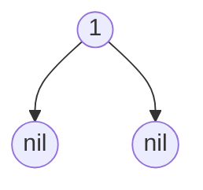
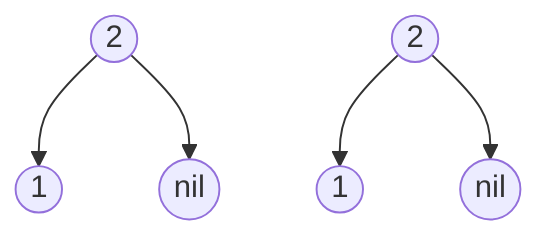
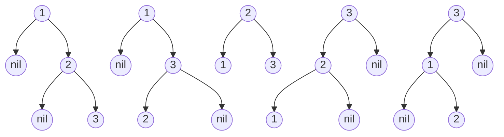

#### 0.目录

| 分 类          | 题 目                                                        | 难 度 | 题解                    |
| -------------- | ------------------------------------------------------------ | ----- | ----------------------- |
| Array          | [剑指 Offer 03. 数组中重复的数字](https://leetcode-cn.com/problems/shu-zu-zhong-zhong-fu-de-shu-zi-lcof/) | E     | [点击跳转](#锚点剑指03) |
| Array          | [剑指 Offer 04. 二维数组中的查找](https://leetcode-cn.com/problems/er-wei-shu-zu-zhong-de-cha-zhao-lcof/) | M     | [点击跳转](#锚点剑指04) |
| Two Pointer    | [3.无重复字符的最长子串](https://leetcode-cn.com/problems/longest-substring-without-repeating-characters/) | M     | [点击跳转](#锚点名2)    |
| Two Pointer    | [11.盛最多水的容器](https://leetcode-cn.com/problems/container-with-most-water/) | M     | [点击跳转](#锚点名11)   |
| Stack          | [20. 有效的括号](https://leetcode-cn.com/problems/valid-parentheses/) | E     | [点击跳转](#锚点名20)   |
| Array Matrix | [74. 搜索二维矩阵](https://leetcode-cn.com/problems/search-a-2d-matrix/) | M     | [点击跳转](#锚点名74)   |
| Tree           | [101. 对称二叉树](https://leetcode-cn.com/problems/symmetric-tree/) | E     | [点击跳转](#锚点名101)  |
| Tree           | [104.二叉树的最大深度](https://leetcode-cn.com/problems/maximum-depth-of-binary-tree/) | E     | [点击跳转](#锚点名104)  |
| Tree           | [110.平衡二叉树](https://leetcode-cn.com/problems/balanced-binary-tree/) | E     | [点击跳转](#锚点名110)  |
| Tree           | [111. 二叉树的最小深度](https://leetcode-cn.com/problems/minimum-depth-of-binary-tree/) | E     |                         |
| Tree           | [112.路径总和](https://leetcode-cn.com/problems/path-sum/)   | M     |                         |
| Tree           | [113.路径总和 II](https://leetcode-cn.com/problems/path-sum-ii/) | M     |                         |
| Stack          | [155. 最小栈](https://leetcode-cn.com/problems/min-stack/)   | E     |                         |
| LinkedList     | [206. 反转链表](https://leetcode-cn.com/problems/reverse-linked-list/) | E     |                         |
| Stack          | [225. 用队列实现栈](https://leetcode-cn.com/problems/implement-stack-using-queues/) | E     |                         |
| Tree           | [226.翻转二叉树](https://leetcode-cn.com/problems/invert-binary-tree/) | E     |                         |
| Queue          | [232. 用栈实现队列](https://leetcode-cn.com/problems/implement-queue-using-stacks/) | E     |                         |
| Array Matrix  | [240. 搜索二维矩阵 II](https://leetcode-cn.com/problems/search-a-2d-matrix-ii/) | M     |                         |
| Array          | [283. 移动零](https://leetcode-cn.com/problems/move-zeroes/) | E     |                         |
| Tree           | [404. 左叶子之和](https://leetcode-cn.com/problems/sum-of-left-leaves/) | E     |                         |
| Tree           | [437. 路径总和 III](https://leetcode-cn.com/problems/path-sum-iii/) | M     |                         |
| Array          | [485. 最大连续 1 的个数](https://leetcode-cn.com/problems/max-consecutive-ones/) | E     |                         |
| Array Matrix  | [503. 下一个更大元素 II](https://leetcode-cn.com/problems/next-greater-element-ii/) | M     |                         |
| Tree           | [543.二叉树的直径](https://leetcode-cn.com/problems/diameter-of-binary-tree/) | E     |                         |
| Array Matrix  | [566. 重塑矩阵](https://leetcode-cn.com/problems/reshape-the-matrix/) | E     |                         |
| Tree           | [572. 另一个树的子树](https://leetcode-cn.com/problems/subtree-of-another-tree/) | E     |                         |
| Tree           | [617.合并二叉树](https://leetcode-cn.com/problems/merge-two-binary-trees/) | E     |                         |
| dfs            | [687. 最长同值路径](https://leetcode-cn.com/problems/longest-univalue-path/) | M     |                         |
| Stack          | [739. 每日温度](https://leetcode-cn.com/problems/daily-temperatures/) | M     |                         |
|                |                                                              |       |                         |
|                |                                                              |       |                         |
|                |                                                              |       |                         |
|                |                                                              |       |                         |
|                |                                                              |       |                         |
|                |                                                              |       |                         |
|                |                                                              |       |                         |
|                |                                                              |       |                         |
|                |                                                              |       |                         |
|                |                                                              |       |                         |
|                |                                                              |       |                         |
|                |                                                              |       |                         |
|                |                                                              |       |                         |


# 常用API

## 集合

| 类/接口       | 描述     | 方法                                                         |
| :------------ | :------- | :----------------------------------------------------------- |
| String        | 字符串   | charAt  toCharArray  split  substring  indexOf  lastIndexOf  replace  length |
| List          | 列表     | add  remove  get  size  subList                              |
| Stack         | 栈       | push  pop  peek  isEmpty  size                               |
| Queue         | 队列     | offer  poll  peek  isEmpty  size                             |
| Deque         | 双向队列 | offerFirst  offerLast  pollFirst pollLast  peekFirst  peekLast isEmpty  size |
| PriorityQueue | 优先队列 | offer poll peek isEmpty size                                 |
| Set           |          | add  remove  contains  isEmpty  size  first(TreeSet)  last(TreeSet) |
| Map           |          | put  get  getOrDefault  containsKey  containsValue  keySet  values  isEmpty size |

## 数组

### Arrays

Arrays是比较常用的数组工具类，可以完成排序、拷贝等功能。

- 从小到大排序：Arrays.sort(int[] arr)``Arrays.sort(int[] arr, int fromIndex, int toIndex)

```java
Arrays.sort(int[] arr, int fromIndex, int toIndex, 比较器);   //一定是需要泛型

Arrays.sort(arr, (o1, o2) -> o2 - o1);   //数组全部 从大到小排序 跟Collections.sort()一样

Arrays.sort(arr, 0, 3, (o1, o2) -> o2 - o1);   //从大到小排序，只排序[0, 3)
```

- 拷贝：Array.copyOf

```java
int[] a = new int[5];
int[] newA = Array.copyOf(a, 5);
```


# 剑指offer

## 数组与矩阵

3. 数组中重复的数字
4. 二维数组中的查找
5. 替换空格
29. 顺时针打印矩阵
50. 第一个只出现一次的字符位置
## 栈队列堆
9. 用两个栈实现队列
30. 包含 min 函数的栈
31. 栈的压入、弹出序列
40. 最小的 K 个数
41.1 数据流中的中位数
41.2 字符流中第一个不重复的字符
59. 滑动窗口的最大值
## 双指针
57.1 和为 S 的两个数字
57.2 和为 S 的连续正数序列
58.1 翻转单词顺序列
58.2 左旋转字符串
## 链表
6. 从尾到头打印链表
18.1 在 O(1) 时间内删除链表节点
18.2 删除链表中重复的结点
22. 链表中倒数第 K 个结点
23. 链表中环的入口结点
24. 反转链表
25. 合并两个排序的链表
35. 复杂链表的复制
52. 两个链表的第一个公共结点
## 树
7. 重建二叉树
8. 二叉树的下一个结点
26. 树的子结构
27. 二叉树的镜像
28. 对称的二叉树
32.1 从上往下打印二叉树
32.2 把二叉树打印成多行
32.3 按之字形顺序打印二叉树
33. 二叉搜索树的后序遍历序列
34. 二叉树中和为某一值的路径
36. 二叉搜索树与双向链表
37. 序列化二叉树
54. 二叉查找树的第 K 个结点
55.1 二叉树的深度
55.2 平衡二叉树
68. 树中两个节点的最低公共祖先
## 贪心思想
14. 剪绳子
63. 股票的最大利润
## 二分查找
11. 旋转数组的最小数字
53. 数字在排序数组中出现的次数
## 分治
16. 数值的整数次方
## 搜索
12. 矩阵中的路径
13. 机器人的运动范围
38. 字符串的排列
## 排序
21. 调整数组顺序使奇数位于偶数前面
45. 把数组排成最小的数
51. 数组中的逆序对
## 动态规划
10.1 斐波那契数列
10.2 矩形覆盖
10.3 跳台阶
10.4 变态跳台阶
42. 连续子数组的最大和
47. 礼物的最大价值
48. 最长不含重复字符的子字符串
49. 丑数
60. n 个骰子的点数
66. 构建乘积数组
## 数学
39. 数组中出现次数超过一半的数字
62. 圆圈中最后剩下的数
43. 从 1 到 n 整数中 1 出现的次数
## 位运算
15. 二进制中 1 的个数
52. 数组中只出现一次的数字

    # 其它
17. 打印从 1 到最大的 n 位数
19. 正则表达式匹配
20. 表示数值的字符串
44. 数字序列中的某一位数字
46. 把数字翻译成字符串
61. 扑克牌顺子
64. 求 1+2+3+...+n
65. 不用加减乘除做加法
67. 把字符串转换成整数


# 分类

## 数组

### 二分查找 

二分查找涉及的很多的边界条件，逻辑比较简单，但就是写不好。例如到底是 `while(left < right)` 还是 `while(left <= right)`，到底是`right = middle`呢，还是要`right = middle - 1`呢？

大家写二分法经常写乱，主要是因为**对区间的定义没有想清楚，区间的定义就是不变量**。要在二分查找的过程中，保持不变量，就是在while寻找中每一次边界的处理都要坚持根据区间的定义来操作，这就是**循环不变量**规则。

写二分法，区间的定义一般为两种，左闭右闭即[left, right]，或者左闭右开即[left, right)。

第一种写法，我们定义 target 是在一个在左闭右闭的区间里，**也就是[left, right]** 

区间的定义这就决定了二分法的代码应该如何写，**因为定义target在[left, right]区间，所以有如下两点：**

- while (left <= right) 要使用 <= ，因为left == right是有意义的，所以使用 <=
- if (nums[middle] > target) right 要赋值为 middle - 1，因为当前这个nums[middle]一定不是target，那么接下来要查找的左区间结束下标位置就是 middle - 1

### 二分法第二种写法

如果说定义 target 是在一个在左闭右开的区间里，也就是[left, right) ，那么二分法的边界处理方式则截然不同。

有如下两点：

- while (left < right)，这里使用 < ,因为left == right在区间[left, right)是没有意义的
- if (nums[middle] > target) right 更新为 middle，因为当前nums[middle]不等于target，去左区间继续寻找，而寻找区间是左闭右开区间，所以right更新为middle，即：下一个查询区间不会去比较nums[middle]

来源

> https://programmercarl.com/0704.%E4%BA%8C%E5%88%86%E6%9F%A5%E6%89%BE.html#%E6%80%9D%E8%B7%AF


#### [704. 二分查找](https://leetcode.cn/problems/binary-search/)

```java
class Solution {
    public int search(int[] nums, int target) {
        int l=0,r=nums.length-1;
        while(l<=r){
            int mid=l+(r-l)/2; // 当left==right，区间[left, right]依然有效，所以用 <=
            if(target==nums[mid])   return mid;
            else if(target>nums[mid]){
                l=mid+1;
            }else{
                r=mid-1;
            }
        }
        return -1;
    }
}
```

#### [35. 搜索插入位置](https://leetcode.cn/problems/search-insert-position/)

```java
class Solution {
    public int searchInsert(int[] nums, int target) {
        int left=0,right=nums.length-1;
       while (left <= right) { // 当left==right，区间[left, right]依然有效
            int middle = left + ((right - left) / 2);// 防止溢出 等同于(left + right)/2
            if (nums[middle] > target) {
                right = middle - 1; // target 在左区间，所以[left, middle - 1]
            } else if (nums[middle] < target) {
                left = middle + 1; // target 在右区间，所以[middle + 1, right]
            } else { // nums[middle] == target
                return middle;
            }
        }
        // 分别处理如下四种情况
        // 目标值在数组所有元素之前  [0, -1]
        // 目标值等于数组中某一个元素  return middle;
        // 目标值插入数组中的位置 [left, right]，return  right + 1
        // 目标值在数组所有元素之后的情况 [left, right]， 因为是右闭区间，所以 return right + 1
        return right + 1;
    }
}
```

#### [34. 在排序数组中查找元素的第一个和最后一个位置](https://leetcode.cn/problems/find-first-and-last-position-of-element-in-sorted-array/)

寻找target在数组里的左右边界，有如下三种情况：

- 情况一：target 在数组范围的右边或者左边，例如数组{3, 4, 5}，target为2或者数组{3, 4, 5},target为6，此时应该返回{-1, -1}
- 情况二：target 在数组范围中，且数组中不存在target，例如数组{3,6,7},target为5，此时应该返回{-1, -1}
- 情况三：target 在数组范围中，且数组中存在target，例如数组{3,6,7},target为6，此时应该返回{1, 1}

这三种情况都考虑到，说明就想的很清楚了。

```java
class Solution {
    public  int[] searchRange(int[] nums, int target) {
        int leftBorder = getLeftBorder(nums, target);
        int rightBorder = getRightBorder(nums, target);
        // 情况一
        if (leftBorder == -2 || rightBorder == -2) return new int[]{-1, -1};
        // 情况三
        if (rightBorder - leftBorder > 1) return new int[]{leftBorder + 1, rightBorder - 1};
        // 情况二
        return new int[]{-1, -1};
    }

    int getRightBorder(int[] nums, int target) {
        int left = 0;
        int right = nums.length - 1;
        int rightBorder = -2; // 记录一下rightBorder没有被赋值的情况
        while (left <= right) {
            int middle = left + ((right - left) / 2);
            if (nums[middle] > target) {
                right = middle - 1;
            } else { // 寻找右边界，nums[middle] == target的时候更新left
                left = middle + 1;
                rightBorder = left;
            }
        }
        return rightBorder;
    }

    int getLeftBorder(int[] nums, int target) {
        int left = 0;
        int right = nums.length - 1;
        int leftBorder = -2; // 记录一下leftBorder没有被赋值的情况
        while (left <= right) {
            int middle = left + ((right - left) / 2);
            if (nums[middle] >= target) { // 寻找左边界，nums[middle] == target的时候更新right
                right = middle - 1;
                leftBorder = right;
            } else {
                left = middle + 1;
            }
        }
        return leftBorder;
    }
}
```


#### [69. x 的平方根 ](https://leetcode.cn/problems/sqrtx/)

##### 方法一：二分查找

```java
class Solution {
    public int mySqrt(int x) {
        int l = 0, r = x, ans = -1;
        while (l <= r) {
            int mid = l + (r - l) / 2;
            if ((long) mid * mid <= x) {
                ans = mid;
                l = mid + 1;
            } else {
                r = mid - 1;
            }
        }
        return ans;
    }
}
```

##### 方法二：牛顿迭代法

求$X^2-a=0$ 的解，过$X_n$作切线得 $Y=2X_n(X-X_n)+{X_{(n)}}^2-a$ 

与横轴的交点为方程$2X_n(X-X_n)+{X_{(n)}}^2-a=0$的解，即为新的迭代结果 $X_{(n+1)}$:
$$
X_{(n+1)}=\frac{1}{2}  (\frac{a}{X_n}+X_n)
$$


注意==`int*int`== 会溢出  使用long存储乘积

```
class Solution {
    public int mySqrt(int x) {//令x=a，通过迭代不断逼近a的平方根
        if (x<2) return x;
        long r=x;
        while(r*r>x){
            r=(r+x/r)/2;
        }
        return Long.valueOf(r).intValue();
    }
}
```

#### [33. 搜索旋转排序数组](https://leetcode-cn.com/problems/search-in-rotated-sorted-array/)

解析 ：

```yaml
将数组一分为二，其中一定有一个是有序的，另一个可能是有序，也能是部分有序。
此时有序部分用二分法查找。无序部分再一分为二，其中一个一定有序，另一个可能有序，可能无序。就这样循环
```

```Java
class Solution {
    public int search(int[] nums, int target) {
      if(nums.length==0) return -1;
      if(nums.length==1) return nums[0]==target? 0:-1;
      int left=0,right=nums.length-1;
      while(left<=right){
        int mid=left+(right-left)/2;
        if(target==nums[mid]) return mid;
        if(nums[left]<=nums[mid]){//假设左边有序
            if(nums[left]<=target&&nums[mid]>target){//target在左边有序区间内(左边为什么是等号)
              right=mid-1;
            }else{
              left=mid+1;
            }
        }else{//假设右边有序
          if(nums[mid]<target&&nums[right]>=target){//target在右边有序区间内(右边为什么是等号)
              left=mid+1;
          }else{
              right=mid-1;
          }
        }
      }
      return -1;
    }
}
```

#### [367. 有效的完全平方数](https://leetcode.cn/problems/valid-perfect-square/)

```java
class Solution {
    public boolean isPerfectSquare(int num) {
        int l = 0, r = num, ans = -1;
        while (l <= r) {
            int mid = l + (r - l) / 2;
            if ((long) mid * mid <= num) {//防止int*int溢出
                ans = mid;
                l = mid + 1;
            } else {
                r = mid - 1;
            }
        }
        if(ans*ans==num)    return true;
        else return false;
    }
}
```

#### [153. 寻找旋转排序数组中的最小值](https://leetcode.cn/problems/find-minimum-in-rotated-sorted-array/)

```java
class Solution {
public  int findMin(int[] nums) {
        int len = nums.length;
        int low = 0;
        int high = len-1;

//        二分查找
        while(low < high){
//            取中间值
            int mid = (high+low)/2;
//            如果中间值小于最大值，则最大值减小
//            疑问：为什么 high = mid;而不是 high = mid-1;
//            解答：{4,5,1,2,3}，如果high=mid-1，则丢失了最小值1
            if (nums[mid] < nums[high]) {
                high = mid;
            } else {
//                如果中间值大于最大值，则最小值变大
//                疑问：为什么 low = mid+1;而不是 low = mid;
//                解答：{4,5,6,1,2,3}，nums[mid]=6，low=mid+1,刚好nums[low]=1
//                继续疑问：上边的解释太牵强了，难道没有可能low=mid+1,正好错过了最小值
//                继续解答：不会错过!!! 如果nums[mid]是最小值的话，则其一定小于nums[high],走if，就不会走else了
                low = mid+1;
            }
        }
//        疑问：为什么while的条件是low<high,而不是low<=high呢
//        解答：low<high，假如最后循环到{*,10,1,*}的这种情况时，nums[low]=10,nums[high]=1,nums[mid]=10,low=mid+1,
//             直接可以跳出循环了,所以low<high,此时low指向的就是最小值的下标;
//             如果low<=high的话，low=high，还会再不必要的循环一次，此时最后一次循环的时候会发生low==high==mid，
//             则nums[mid]==nums[high]，则会走一次else语句，则low=mid+1,此时low指向的是最小值的下一个下标，
//             则需要return[low-1]
        return nums[low];
    }
}
```


#### [41. 缺失的第一个正数](https://leetcode.cn/problems/first-missing-positive/)

方法一：

```java
class Solution {
    public int firstMissingPositive(int[] nums) {
        //哈希标记法
        //本题利用负号来标记，nums[i]<0表示i+1存在
        int n = nums.length;
        for (int i = 0; i < n; ++i) {
            if (nums[i] <= 0) {
                nums[i] = n + 1;
            }
        }
        for (int i = 0; i < n; ++i) {
            int num = Math.abs(nums[i]);
            if (num <= n) {
                nums[num - 1] = -Math.abs(nums[num - 1]);
            }
        }
        for (int i = 0; i < n; ++i) {
            if (nums[i] > 0) {
                return i + 1;
            }
        }
        return n + 1;

    }
}
```

方法二：

```java
class Solution {
    public int firstMissingPositive(int[] nums) {
        //置换法
        int n=nums.length;
        for(int i=0;i<n;i++){
            while(nums[i]>0&&nums[i]<=n&&nums[nums[i]-1]!=nums[i]){
                int tmp=nums[nums[i]-1];
                nums[nums[i]-1]=nums[i];
                nums[i]=tmp;
            }
        }

        for(int i=0;i<n;i++){
            if(nums[i]!=i+1){
                return i+1;
            }
        }

        return n+1;
    }
}
```


### 移除元素

#### [27. 移除元素](https://leetcode.cn/problems/remove-element/)

```java
class Solution {
    public int removeElement(int[] nums, int val) {
        int i=0,p=0;
        while(p<=nums.length-1){
            if(nums[p]!=val){
                nums[i++]=nums[p];
            }
            p++;
        }
        return i;
    }
}
```

#### [26. 删除有序数组中的重复项](https://leetcode.cn/problems/remove-duplicates-from-sorted-array/)

```java
class Solution {
    public int removeDuplicates(int[] nums) {
        int i=0,p=1;
        while(p<=nums.length-1){
            if(nums[p]!=nums[i]){
                nums[++i]=nums[p];
            }
            p++;
        }
        return i+1;
    }
}
```


#### [56. 合并区间](https://leetcode.cn/problems/merge-intervals/)

```java
class Solution {
    public int[][] merge(int[][] intervals) {
        List<int[]> res = new LinkedList<>();
        //按起点排序
        Arrays.sort(intervals, (o1, o2) -> Integer.compare(o1[0], o2[0]));
        int start=intervals[0][0];
        for(int i=1;i<intervals.length;i++){
            if(intervals[i-1][1]<intervals[i][0]){//当第二个的0大于第一个的1盖棺定论第一个区间可以添加到答案集合里(也就是不重叠)
                res.add(new int[]{start,intervals[i-1][1]});
                start=intervals[i][0];//重置起点为第二个的0
            }else{//重叠的情况,把后者的1改为两者的max，同时有重叠暂时不加入结果集，等后面分割开再加进去
                intervals[i][1]=Math.max(intervals[i][1], intervals[i - 1][1]);
            }
        }
        res.add(new int[]{start, intervals[intervals.length - 1][1]});//最后的区间加上
        return res.toArray(new int[res.size()][]);
    }
}
```

#### [189. 轮转数组](https://leetcode.cn/problems/rotate-array/)

```java
class Solution {
    public void rotate(int[] nums, int k) {
        k=k%nums.length;
        reverse(nums,0,nums.length-1);
        reverse(nums,0,k-1);
        reverse(nums,k,nums.length-1);
    }

    public void reverse(int[] nums,int start,int end){
        while(start<end){
            int temp=nums[start];
            nums[start]=nums[end];
            nums[end]=temp;
            start++;
            end--;
        }
    }

}
```

#### [41. 缺失的第一个正数](https://leetcode.cn/problems/first-missing-positive/)


### 矩阵

#### [73. 矩阵置零](https://leetcode.cn/problems/set-matrix-zeroes/)

##### 方法一

```java
class Solution {
    public void setZeroes(int[][] matrix) {
        int m=matrix.length,n=matrix[0].length;
        boolean [] row=new boolean [m];
        boolean [] column=new boolean [n];
        for(int i=0;i<m;i++){
            for(int j=0;j<n;j++){
                if(matrix[i][j]==0){
                    row[i]=true;
                    column[j]=true;
                }
            }
        }
        for(int i=0;i<m;i++){
            for(int j=0;j<n;j++){
                
                   if(row[i]||column[j]){
                       matrix[i][j]=0;
                   }
               
            }
        }
    }
}
```

##### 方法二

我们可以用矩阵的第一行和第一列代替方法一中的两个标记数组，以达到 O(1) 的额外空间。但这样会导致原数组的第一行和第一列被修改，无法记录它们是否原本包含 0。因此我们需要额外使用两个标记变量分别记录第一行和第一列是否原本包含 0。

在实际代码中，我们首先预处理出两个标记变量，接着使用其他行与列去处理第一行与第一列，然后反过来使用第一行与第一列去更新其他行与列，最后使用两个标记变量更新第一行与第一列即可。

作者：力扣官方题解
链接：https://leetcode.cn/problems/set-matrix-zeroes/solutions/669901/ju-zhen-zhi-ling-by-leetcode-solution-9ll7/
来源：力扣（LeetCode）
著作权归作者所有。商业转载请联系作者获得授权，非商业转载请注明出处。

```java
class Solution {
    public void setZeroes(int[][] matrix) {
        int m=matrix.length,n=matrix[0].length;
        boolean  flagrow0=false;
        boolean  flagcolumn0=false;
        for(int i=0;i<m;i++){//第一列
            if(matrix[i][0]==0){
                flagcolumn0=true;
                break;
            }
        }
         for(int j=0;j<n;j++){//第一行
             if(matrix[0][j]==0){
                flagrow0=true;
                break;
            }
         }
        for(int i=1;i<m;i++){
            for(int j=1;j<n;j++){
                if(matrix[i][j]==0){
                    matrix[i][0]=0;
                    matrix[0][j]=0;
                }
            }
        }
        for(int i=1;i<m;i++){
            for(int j=1;j<n;j++){               
                   if( matrix[i][0]==0||matrix[0][j]==0){
                       //如果第一行第一列是后面matrix[i][j]被动影响的只是重复给matrix[i][j]=0赋值了一次而已，如果第一行第一列确实有0则正好需要将matrix[i][j]赋值为0
                       matrix[i][j]=0;
                   }              
            }
        }
        
        if(flagrow0){
            for(int j=0;j<n;j++){
                matrix[0][j]=0;
            }
        }
         if(flagcolumn0){
            for(int i=0;i<m;i++){
                matrix[i][0]=0;
            }
        }

    }
}
```


##### 方法三

**使用一个标记变量**

我们可以对方法二进一步优化，只使用一个标记变量记录第一列是否原本存在0。这样，第一列的第一个元素即可以标记第一行是否出现 0。但为了防止每一列的第一个元素被提前更新，我们需要从最后一行开始，倒序地处理矩阵元素。

作者：力扣官方题解
链接：https://leetcode.cn/problems/set-matrix-zeroes/solutions/669901/ju-zhen-zhi-ling-by-leetcode-solution-9ll7/
来源：力扣（LeetCode）
著作权归作者所有。商业转载请联系作者获得授权，非商业转载请注明出处。

```java
class Solution {
    public void setZeroes(int[][] matrix) {
        int m = matrix.length, n = matrix[0].length;
        boolean flagCol0 = false;
        for (int i = 0; i < m; i++) {
            if (matrix[i][0] == 0) {
                flagCol0 = true;
            }
            for (int j = 1; j < n; j++) {
                if (matrix[i][j] == 0) {
                    matrix[i][0] = matrix[0][j] = 0;
                }
            }
        }
        for (int i = m - 1; i >= 0; i--) {
            for (int j = 1; j < n; j++) {
                if (matrix[i][0] == 0 || matrix[0][j] == 0) {//matrix[0][0]现在存了flagRow0也就是第一行是否有0，所以需要最后遍历第一行
                    matrix[i][j] = 0;
                }
            }
            if (flagCol0) {//通过标志刷新第一列
                matrix[i][0] = 0;
            }
        }
    }
}
```

#### [54. 螺旋矩阵](https://leetcode.cn/problems/spiral-matrix/)

通过**count**记录是否结束，定义四个变量 **left** **right**  **top** **botten**代表左右上下边界  然后**从左到右 ** **从上到下**  **从右到左** **从下到上** 遍历 不断调整边界

```java
class Solution {
    public List<Integer> spiralOrder(int[][] matrix) {
        List<Integer> res=new ArrayList<>();
        int m=matrix[0].length,n=matrix.length;
        int l=0,r=m-1,t=0,b=n-1;
        int count=0;
        while(count<m*n){
            //从左到右
            for(int i=l;i<=r&&count<m*n;i++){
                res.add(matrix[t][i]);
                count++;
            }
            t++;
            //从上到下
            for(int i=t;i<=b&&count<m*n;i++){
                res.add(matrix[i][r]);
                count++;
            }
            r--;
            //从右到左
            for(int i=r;i>=l&&count<m*n;i--){
                res.add(matrix[b][i]);
                count++;
            }
            b--;
            //从下到上
            for(int i=b;i>=t&&count<m*n;i--){
                res.add(matrix[i][l]);
                count++;
            }
            l++;
        }

        return res;
    }
}
```

#### [240. 搜索二维矩阵 II](https://leetcode.cn/problems/search-a-2d-matrix-ii/)

```java
class Solution {
    public boolean searchMatrix(int[][] matrix, int target) {
        int m=matrix.length,n=matrix[0].length;
        int i=m-1,j=0;
        while(i>=0&&j<n){
            if(target==matrix[i][j]){
                return true;
            }else if(target>matrix[i][j]){
                j++;
            }else{
                i--;
            }
        }
        return false;
    }
}
```

#### [48. 旋转图像](https://leetcode.cn/problems/rotate-image/)

##### 方法一：

复制一个矩阵，通过旋转填充

方法二：原地修改

```java
class Solution {
    public void rotate(int[][] matrix) {
        int n = matrix.length;
        for (int i = 0; i < n / 2; i++) {
            for (int j = 0; j < (n + 1) / 2; j++) {
                int tmp = matrix[i][j];
                matrix[i][j] = matrix[n - 1 - j][i];
                matrix[n - 1 - j][i] = matrix[n - 1 - i][n - 1 - j];
                matrix[n - 1 - i][n - 1 - j] = matrix[j][n - 1 - i];
                matrix[j][n - 1 - i] = tmp;
            }
        }
    }
}

```


##   链表

#### [25. K 个一组翻转链表](https://leetcode.cn/problems/reverse-nodes-in-k-group/)

```java

class Solution {
    public ListNode reverseKGroup(ListNode head, int k) {
        if(k==1) return head;
        ListNode preHead = new ListNode();//全链表头节点
        preHead.next=head;
        ListNode pre=preHead;//存储每一组的前一个节点
        while(head!=null){//head作为工作指针
            ListNode p=pre;//p开始是指向每一组的前一个节点(开)，然后前进到每组的最后一个节点(闭)
            int i=0;
            while(i++<k){
                p=p.next;
                if(p==null){
                    return preHead.next;//遇到不足k个的，直接返回整个链表结束
                }
            }

            ListNode nex = p.next; //保存下一组的起始节点
            ListNode [] res = reverse (head,p);
            head=res[0];
            p=res[1];
            ////把子链表重新接回原链表
            pre.next=head;
            p.next=nex;
            pre=p;
            head=p.next;

        }

        return preHead.next;
    }

    public ListNode [] reverse(ListNode l,ListNode r){
        //反转【l,r】并返回节点起始和结束节点
        //迭代法反转链表
        ListNode prev=r.next;//ListNode prev=null也可以因为上面保存了r的下一个节点不会断链，ListNode prev=null写法可以和反转链表模板一致
        ListNode p=l;
        while(prev!=r){
            ListNode nex = p.next;
            p.next = prev;
            prev = p;
            p = nex;
        }
        return new ListNode []{r,l};
    }
}
```


#### [206. 反转链表](https://leetcode.cn/problems/reverse-linked-list/)

```java
//头插法-带虚拟头节点
class Solution {
    public ListNode reverseList(ListNode head) {  
        ListNode preHead=new ListNode();
        ListNode p=head;
        ListNode q=null;
        while(p!=null){
            q=p.next;
            p.next=preHead.next;
            preHead.next=p;
            p=q;           
        }
        return preHead.next;
    }
}

//头插法-不带虚拟头节点   和迭代法一样
class Solution {
    public ListNode reverseList(ListNode head) {
        ListNode prev = null;
        ListNode curr = head;
        while (curr!= null) {
            ListNode nextTemp = curr.next;
            curr.next = prev;
            prev = curr;
            curr = nextTemp;
        }
        return prev;
    }
}
```


```java
//迭代法  p为工作指针，prev为p的前置，每次将p.next指向prev
class Solution {
    public ListNode reverseList(ListNode head) {     
        ListNode prev=null;
        ListNode p=head;
        while(p!=null){
            ListNode nex = p.next;
            p.next = prev;
            prev = p;
            p = nex;
        }
        return prev;
    }
}
```

#### [160. 相交链表](https://leetcode.cn/problems/intersection-of-two-linked-lists/)

```java
public class Solution {
    public ListNode getIntersectionNode(ListNode headA, ListNode headB) {
        if(headA==null||headB==null){
            return null;
        }
        ListNode pa = headA , pb = headB;

        while(pa!=pb){
            pa = pa == null ? headB : pa.next;
            pb = pb == null ? headA : pb.next;
        }

        return pa;
    }
}
```

#### [141. 环形链表](https://leetcode.cn/problems/linked-list-cycle/)

```java
public class Solution {
    public boolean hasCycle(ListNode head) {
        if (head == null || head.next == null) {
            return false;
        }
        ListNode f=head.next,s=head;
        while(f!=s){
            if(f==null||f.next==null) return false;
            f=f.next.next;
            s=s.next;
        }
        return true;
    }
}
```

#### [142. 环形链表 II](https://leetcode.cn/problems/linked-list-cycle-ii/)

假设单链长度a,环链长度b。定义快慢指针f、s 。

第一次相遇 f-s=nb ，f=2s  得出 s=nb，  又当跑过a+nb长刚好到达环链起点，则把f指向头节点，当f前进a步正好和s在环链起点相遇

```java
public class Solution {
    public boolean hasCycle(ListNode head) {
        if (head == null || head.next == null) {
            return false;
        }
        ListNode f=head.next,s=head;
        while(f!=s){
            if(f==null||f.next==null) return false;
            f=f.next.next;
            s=s.next;
        }
        return true;
    }
}
```

#### [234. 回文链表](https://leetcode.cn/problems/palindrome-linked-list/)

##### 方法一：

复制一个链表判断，时间复杂度O（n)  ，空间复杂度O（n)

##### 方法二：

递归  时间复杂度O（n)  ，空间复杂度O（n)

##### 方法三

反转一半链表后用双指针判断

时间复杂度O（n)  ，空间复杂度O（1)

#### [2. 两数相加](https://leetcode-cn.com/problems/add-two-numbers/)

**解析**

数字已经是逆置的了，所以只需要保存进位即可，最后进位大于0需要多一个节点--对于类似（5+7=12）多了一位。

```java
class Solution {
    public ListNode addTwoNumbers(ListNode l1, ListNode l2) {
        ListNode head=null,tail=null;
        int carry=0;
        while(l1!=null||l2!=null){
            int n1 = l1 ==  null? 0:l1.val;
            int n2 = l2 ==  null? 0:l2.val;

            int sum = n1+n2+carry;
            carry = sum /10;
            if(head==null) head = tail = new ListNode(sum%10);
            else{
                tail.next = new ListNode(sum%10);
                tail = tail.next;
            }

            if(l1!=null) l1 = l1.next;
            if(l2!=null) l2 = l2.next;
        }

        if(carry>0) tail.next = new ListNode(carry);

        return head; 

    }
}
```


#### [24. 两两交换链表中的节点](https://leetcode.cn/problems/swap-nodes-in-pairs/)

1.递归

```java
class Solution {
    public ListNode swapPairs(ListNode head) {
        if(head==null||head.next==null) return head;
        ListNode newHead = head.next;
        head.next = swapPairs(newHead.next);
        newHead.next = head;
        return newHead;
    }
}
```

2.迭代

构建一个临时节点用来存储每两个节点的前置节点，tmp->node1->node2

则进行交换后      tmp->node2->node1,然后tmp=node1；


```java
class Solution {
    public ListNode swapPairs(ListNode head) {
        ListNode preHead=new ListNode();
        preHead.next=head;
        ListNode tmp=preHead;
        while(tmp.next!=null&&tmp.next.next!=null){
            ListNode p1=preHead.next;
            ListNode p2=preHead.next.next;
            tmp.next=p2;
            p1.next=p2.next;
            p2.next=p1;
            tmp=p1;

        }
        return preHead.next;
    }
}
```

#### [138. 随机链表的复制](https://leetcode.cn/problems/copy-list-with-random-pointer/)

哈希表存储构建 **原链表节点** 和 **新链表对应节点** 的键值对映射关系

```java
class Solution {
    public Node copyRandomList(Node head) {
         if(head == null) return null;
        Node cur = head;
        Map<Node, Node> map = new HashMap<>();
        // 3. 复制各节点，并建立 “原节点 -> 新节点” 的 Map 映射
        while(cur != null) {
            map.put(cur, new Node(cur.val));
            cur = cur.next;
        }
        cur = head;
        // 4. 构建新链表的 next 和 random 指向
        while(cur != null) {
            map.get(cur).next = map.get(cur.next);
            map.get(cur).random = map.get(cur.random);
            cur = cur.next;
        }
        // 5. 返回新链表的头节点
        return map.get(head);

    }
}
```

#### [108. 将有序数组转换为二叉搜索树](https://leetcode.cn/problems/convert-sorted-array-to-binary-search-tree/)

```java
class Solution {
    public TreeNode sortedArrayToBST(int[] nums) {
         return helper(nums, 0, nums.length - 1);
    }

    public TreeNode helper(int[] nums, int left, int right) {
        if (left > right) {
            return null;
        }

        // 总是选择中间位置左边的数字作为根节点
        int mid = (left + right) / 2;

        TreeNode root = new TreeNode(nums[mid]);
        root.left = helper(nums, left, mid - 1);
        root.right = helper(nums, mid + 1, right);
        return root;

    }
}
```

#### [230. 二叉搜索树中第K小的元素](https://leetcode.cn/problems/kth-smallest-element-in-a-bst/)

```java
class Solution {
    int result,n;
    public int kthSmallest(TreeNode root, int k) {
        n = k;
        traversal(root);
        return result;
    }
    public void traversal(TreeNode root){
        if(root==null) return ;
        traversal(root.left);
        if(n==0) return ;
        if(--n==0) result=root.val;
        traversal(root.right);
        
    }

}
```


## 哈希表

#### [1. 两数之和](https://leetcode.cn/problems/two-sum/)

利用哈希表存储<**nums[i]**,**i**>的关系，后面查找**target-nums[i]**就可以直接使用

```java
class Solution {
    public int[] twoSum(int[] nums, int target) {
        Map<Integer,Integer> mp=new HashMap<>();
        for(int i=0;i<nums.length;i++){
            if(mp.containsKey(target-nums[i])){
                return new int []{mp.get(target - nums[i]), i};
            }
            mp.put(nums[i],i);
        }
        return new int[0];
    }
}
```

#### [49. 字母异位词分组](https://leetcode.cn/problems/group-anagrams/)

**字母异位词** 是由重新排列源单词的所有字母得到的一个新单词，所以可以将字母排序后作为key，value为所有字母异位词

```java
class Solution {
    public List<List<String>> groupAnagrams(String[] strs) {
        Map<String,List<String>> mp=new HashMap<String,List<String>>();
        for(String str:strs){
            char [] array=str.toCharArray();
            Arrays.sort(array);
            String key=new String(array);
            List<String> list = mp.getOrDefault(key, new ArrayList<String>());//已存在则返回当前value，否则new一个
            list.add(str);
            mp.put(key,list);
        }
        return new ArrayList<List<String>>(mp.values());
    }
}
```

#### [128. 最长连续序列](https://leetcode.cn/problems/longest-consecutive-sequence/)

用set存储，然后不断从set中取连续的数开始计数，取最大值（不要求连续的大多用set）

```java
class Solution {
    public int longestConsecutive(int[] nums) {
        int max=0;
        Set<Integer> st=new HashSet<Integer>();
        for(int i=0;i<nums.length;i++){
            st.add(nums[i]);
        }
        for(int i=0;i<nums.length;i++){
            if(!st.contains(nums[i]-1)){//增加的跳过逻辑  可从O(n^2)优化到O(n) 保证每个数字只走一次while即只为增长序列的起始位置才开始算
            	int a=nums[i];
            	int t=1;
            	while(st.contains(a+1)){
                	t++;
                	a++;
            	}
            	if(t>max) max=t;
            }
        }
        return max;
    }
}
```

## 双指针

#### [283. 移动零](https://leetcode.cn/problems/move-zeroes/)

```java
class Solution {
    public void moveZeroes(int[] nums) {
       int index=0;
       for(int i=0;i<nums.length;i++){
           if(nums[i]!=0){
               nums[index++]=nums[i];
           }
       }
       for(int j=index;j<nums.length;j++){
           nums[index++]=0;
       }
    }  
}
```

#### [11. 盛最多水的容器](https://leetcode.cn/problems/container-with-most-water/)

```java
class Solution {
    public int maxArea(int[] height) {
        int l=0,r=height.length-1,max=0;
        while(l<r){
            max=Math.max(max,Math.min(height[l],height[r])*(r-l));
            if(height[r]>height[l]) l++;
            else{
                r--;
            }
        }
        return max;
    }
}
```

#### [15. 三数之和](https://leetcode.cn/problems/3sum/)

排序＋哈希表

```java
class Solution {
    public List<List<Integer>> threeSum(int[] nums) {
        List<List<Integer>> res=new ArrayList<>();
        Arrays.sort(nums);
        Set<Integer> st=new HashSet<Integer>();
        for(int i=0;i<nums.length;i++){
            if(nums[i]>0) return res; //第一个必须未非正数才能找到加起来为0的
            if(i>0 && nums[i]==nums[i-1]) continue;//重复数字往前走
            int l=i+1,r=nums.length-1;
            while(l<r){
                int tmp=nums[i]+nums[l]+nums[r];
                if(tmp==0){
                    List<Integer> list = new ArrayList<>();
                    list.add(nums[i]);
                    list.add(nums[l]);
                    list.add(nums[r]);
                    res.add(list);
                    while(l<r&&nums[l]==nums[l+1]) ++l;//遇到新的重复的直接往前走,缺少这步会导致第二个第三个重复
                    while(l<r&&nums[r]==nums[r-1]) --r;
                    l++;
                    r--;//指针继续往中间走到第一个与前一个不相同的数字的下标上
                }else if(tmp<0){
                    l++;
                }else{
                    r--;
                }
            }
            
        }
        return res;
    }
}
```


#### [42. 接雨水](https://leetcode.cn/problems/trapping-rain-water/)

按列计算，用哈希表计算每一列水柱最高

```java
class Solution {
    public int trap(int[] height) {
        //按列计算，找到两边最高柱中的较低者
        int length = height.length;
        if (length <= 2) return 0;        
        int sum = 0;
        for(int i=1;i<length-1;i++){//两个边无法接水
            //遍历时往两边找到最高的柱子
            int  maxLeft =height[i];
            int  maxRight =height[i];
            for (int j = i+1; j< length; j++) maxLeft = Math.max(height[j], maxLeft);
            for (int k = i-1; k>=0; k--)      maxRight = Math.max(height[k], maxRight);
            int count = Math.min(maxLeft, maxRight) - height[i];
            if (count > 0) sum += count;//凸形的可能为负，不需要累计
        }
        
        return sum;
    }
}
```

```java
//双指针优化版
class Solution {
    public int trap(int[] height) {
        //按列计算，找到两边最高柱中的较低者
        int length = height.length;
        if (length <= 2) return 0;
        int[] maxLeft = new int[length]; //maxLeft[i]表示
        int[] maxRight = new int[length];
        
        // 记录每个柱子左边柱子最大高度
        maxLeft[0] = height[0];
        for (int i = 1; i< length; i++) maxLeft[i] = Math.max(height[i], maxLeft[i-1]);
        
        // 记录每个柱子右边柱子最大高度
        maxRight[length - 1] = height[length - 1];
        for(int i = length - 2; i >= 0; i--) maxRight[i] = Math.max(height[i], maxRight[i+1]);
        
        // 求和
        int sum = 0;
        for (int i = 0; i < length; i++) {
            int count = Math.min(maxLeft[i], maxRight[i]) - height[i];
            if (count > 0) sum += count;//凸形的可能为负，不需要累计
        }
        return sum;
    }
}
```

#### [522. 最长特殊序列 II](https://leetcode.cn/problems/longest-uncommon-subsequence-ii/)

```java
class Solution {
   public int findLUSlength(String[] strs) {
        int n = strs.length;
        int ans = -1;
        for (int i = 0; i < n; i++) {
            boolean check = false;//s1是否是s2的子串(可通过删减s2得到s1)
            for (int j = 0; j < n; j++) {
                if (i != j && isSubseq(strs[i], strs[j])) {
                    check = true;
                    break;//只要找到一个s1是s2的子串的情况,s1就不再是特殊序列,寻找下一个i
                }
            }
            if (!check) {
                ans = Math.max(ans, strs[i].length());
            }
        }
        return ans;
    }

    public boolean isSubseq(String s, String t) {
        int p1 = 0, p2 = 0;
        while (p1 < s.length() && p2 < t.length()) {
            if (s.charAt(p1) == t.charAt(p2)) {
               p1++;
            }
            p2++;
        }
        return p1 == s.length();
    }

}
```


## 滑动窗口

滑动窗口模板

```c++
int left = 0, right = 0;

while (right < s.size()) {
    // 增大窗口
    window.add(s[right]);
    right++;

    while (window needs shrink) {
        // 缩小窗口
        window.remove(s[left]);
        left++;
    }
}
```


#### [3. 无重复字符的最长子串](https://leetcode.cn/problems/longest-substring-without-repeating-characters/)

```java
//通过Set辅助判断重复，滑动时剔除左边窗口值
class Solution {
    public int lengthOfLongestSubstring(String s) {
        Set<Character> set=new HashSet<>();//存储从l到r的子串字符
        int l=0,r=0,res=0;
        while(l<s.length()){
            if(res>s.length()-l-1)
                break;//提前结束

            while(r<s.length()&&!set.contains(s.charAt(r))){
                set.add(s.charAt(r));
                r++;
            }
            res=Math.max(res,r-l);
            while(r<s.length()&&set.contains(s.charAt(r))){//
                set.remove(s.charAt(l));
                l++;
            }

        }

        return res;
    }
}
```

#### [438. 找到字符串中所有字母异位词](https://leetcode.cn/problems/find-all-anagrams-in-a-string/)

字符题，可通过 **s.charAt(i) - 'a'** 作为下标 ，本题不考虑输出顺序，只需要记录**s.charAt(i) - 'a'**出现次数

使用了工具**Arrays.equals**判断两个数组是否相等

```java
class Solution {
    public List<Integer> findAnagrams(String s, String p) {
        int sLen = s.length(), pLen = p.length();

        if (sLen < pLen) {
            return new ArrayList<Integer>();
        }

        List<Integer> ans = new ArrayList<Integer>();
         //建立两个数组存放字符串中字母出现的词频，并以此作为标准比较
        int[] sCount = new int[26];
        int[] pCount = new int[26];
         //当滑动窗口的首位在s[0]处时 （相当于放置滑动窗口进入数组）
        for (int i = 0; i < pLen; ++i) {
            ++sCount[s.charAt(i) - 'a'];//记录s中前pLen个字母的词频
            ++pCount[p.charAt(i) - 'a'];//记录要寻找的字符串中每个字母的词频(只用进行一次来确定)
        }
        //判断放置处是否有异位词     (在放置时只需判断一次)
        if (Arrays.equals(sCount, pCount)) {
            ans.add(0);
        }
        //开始让窗口进行滑动
        for (int i = 0; i < sLen - pLen; ++i) {//i是滑动前的首位
            --sCount[s.charAt(i) - 'a'];//将滑动前首位的词频删去
            ++sCount[s.charAt(i + pLen) - 'a'];//增加滑动后最后一位的词频（以此达到滑动的效果）
            //判断滑动后处，是否有异位词
            if (Arrays.equals(sCount, pCount)) {
                ans.add(i + 1);
            }
        }

        return ans;

    }
}
```


## 子串

#### [560. 和为 K 的子数组](https://leetcode.cn/problems/subarray-sum-equals-k/)

✔✔✔**前缀和**

使用了**Map.getOrDefault(pre, 0)** 获取默认值，常规操作

```java
class Solution {
    public int subarraySum(int[] nums, int k) {
    /*
    使用前缀和的方法可以解决这个问题，因为我们需要找到和为k的连续子数组的个数.
    通过计算前缀和，我们可以将问题转化为求解两个前缀和之差等于k的情况。
    假设数组的前缀和数组为prefixSum，其中prefixSum[i]表示从数组起始位置
    到第i个位置的元素之和。那么对于任意的两个下标i和j（i < j），如果
    prefixSum[j] - prefixSum[i] = k，即从第i个位置到第j个位置的元素之和等于k，
    那么说明从第i+1个位置到第j个位置的连续子数组的和为k。
    通过遍历数组，计算每个位置的前缀和，并使用一个哈希表来存储每个前缀和
    出现的次数。在遍历的过程中，我们检查是否存在prefixSum[j] - k的前缀和，
    如果存在，说明从某个位置到当前位置的连续子数组的和为k，我们将对应的次数累加到结果中。
    这样，通过遍历一次数组，我们可以统计出和为k的连续子数组的个数，并且时间复杂度为O(n)，其中n为数组的长度。
    */
        int count = 0, pre = 0;
        HashMap < Integer, Integer > mp = new HashMap < > ();
        mp.put(0, 1);//如果没有这个初始化，那么sum-k=0时，map中没有0，判断为false，就会漏掉这种情况
        for (int i = 0; i < nums.length; i++) {
            pre += nums[i];
            if (mp.containsKey(pre - k)) {
                count += mp.get(pre - k);
            }
            mp.put(pre, mp.getOrDefault(pre, 0) + 1);
        }
        return count;

    }
}
```


#### [239. 滑动窗口最大值](https://leetcode.cn/problems/sliding-window-maximum/)

```java
class Solution {
    public int[] maxSlidingWindow(int[] nums, int k) {
        if(nums.length == 0 || k == 0) return new int[0];
        Deque<Integer> deque = new LinkedList<>();
        int[] res = new int[nums.length - k + 1];
        for(int j = 0, i = 1 - k; j < nums.length; i++, j++) {
            // 删除 deque 中对应的 nums[i-1]
            if(i > 0 && deque.peekFirst() == nums[i - 1])
                deque.removeFirst();
            // 保持 deque 递减
            while(!deque.isEmpty() && deque.peekLast() < nums[j])
                deque.removeLast();
            deque.addLast(nums[j]);
            // 记录窗口最大值
            if(i >= 0)
                res[i] = deque.peekFirst();
        }
        return res;
    }
}
```

#### [76. 最小覆盖子串](https://leetcode.cn/problems/minimum-window-substring/)

```java
class Solution {
    public String minWindow(String s, String t) {
         char[] chars = s.toCharArray(), chart = t.toCharArray();
        int n = chars.length, m = chart.length;

        int[] hash = new int[128];
        for (char ch : chart) hash[ch]--;

        String res = "";
        for (int i = 0, j = 0, cnt = 0; i < n; i++) {
            hash[chars[i]]++;
            if (hash[chars[i]] <= 0) cnt++;
            while (cnt == m && hash[chars[j]] > 0) hash[chars[j++]]--;
            if (cnt == m)
                if (res.equals("") || res.length() > i - j + 1)
                    res = s.substring(j, i + 1);
        }
        return res;
    }
}
```

## 普通数组

#### [53. 最大子数组和](https://leetcode.cn/problems/maximum-subarray/)

```java
class Solution {
    public int maxSubArray(int[] nums) {
        int [] dp=new int [nums.length];//表示以i为结尾的最大连续子数组
        //dp[i]=max(dp[i-1]+nums[i],nums[i])
        dp[0]=nums[0];
        int max=nums[0];
        for(int i=1;i<nums.length;i++){
            dp[i]=Math.max(dp[i-1]+nums[i],nums[i]);
            max=Math.max(dp[i],max);
        }
        return max;
    }
}
```

#### [238. 除自身以外数组的乘积](https://leetcode.cn/problems/product-of-array-except-self/)

```java
class Solution {
    public int[] productExceptSelf(int[] nums) {
        int len=nums.length;
        int [] res=new int [len];
        Arrays.fill(res,1);
        int Lsum=1;
        int Rsum=1;

        for(int i=0;i<len;i++){
            res[i]*=Lsum;
            res[len-1-i]*=Rsum;
            Lsum*=nums[i];
            Rsum*=nums[len-1-i];
        }

        return res;

    }
}
```

## 二叉树

#### [98. 验证二叉搜索树](https://leetcode.cn/problems/validate-binary-search-tree/)

##### 方法一：用数组存储中序遍历的结果，验证是否有序

```java

class Solution {
    ArrayList<Integer> list=new ArrayList<>();
    public  void  traversal(TreeNode root){
        if(root==null) return;
        traversal(root.left);
        list.add(root.val);
        traversal(root.right);
    }
    public boolean isValidBST(TreeNode root) {
       if(root==null) return true;
       traversal(root);
       for(int i=1;i<list.size();i++){
            if(list.get(i)<=list.get(i-1)){
                return false;
            }
       }
        return true;
    }
}
```

##### 方法二：直接记录上一个访问节点的值，判断下一个值是否呈递增趋势

- 使用Long.MIN_VALUE作为最小值判断，因为后台测试数据中有int最小值，所以定义为longlong的类型，初始化为longlong最小值。

```java

 class Solution {
    private long prev = Long.MIN_VALUE;
    public boolean isValidBST(TreeNode root) {
        if (root == null) {
            return true;
        }
        if (!isValidBST(root.left)) {
            return false;
        }
        if (root.val <= prev) { // 不满足二叉搜索树条件
            return false;
        }
        prev = root.val;
        return isValidBST(root.right);
    }
}   
```

方法三：递归简洁版本

```java
// 简洁实现·递归解法
class Solution {
    public boolean isValidBST(TreeNode root) {
        return validBST(Long.MIN_VALUE, Long.MAX_VALUE, root);
    }
    boolean validBST(long lower, long upper, TreeNode root) {
        if (root == null) return true;
        if (root.val <= lower || root.val >= upper) return false;
        return validBST(lower, root.val, root.left) && validBST(root.val, upper, root.right);
    }
}
```

#### [114. 二叉树展开为链表](https://leetcode.cn/problems/flatten-binary-tree-to-linked-list/)

##### 解法一

可以发现展开的顺序其实就是二叉树的先序遍历。算法和 94 题中序遍历的 Morris 算法有些神似，我们需要两步完成这道题。

- 将左子树插入到右子树的地方

- 将原来的右子树接到左子树的最右边节点

- 考虑新的右子树的根节点，一直重复上边的过程，直到新的右子树为 null


  可以看图理解下这个过程。

```java

    1
   / \
  2   5
 / \   \
3   4   6

//将 1 的左子树插入到右子树的地方
    1
     \
      2         5
     / \         \
    3   4         6        
//将原来的右子树接到左子树的最右边节点
    1
     \
      2          
     / \          
    3   4  
         \
          5
           \
            6
            
 //将 2 的左子树插入到右子树的地方
    1
     \
      2          
       \          
        3       4  
                 \
                  5
                   \
                    6   
        
 //将原来的右子树接到左子树的最右边节点
    1
     \
      2          
       \          
        3      
         \
          4  
           \
            5
             \
              6         


```


代码的话也很好写，首先我们需要找出左子树最右边的节点以便把右子树接过来。

```java
public void flatten(TreeNode root) {
    while (root != null) { 
        //左子树为 null，直接考虑下一个节点
        if (root.left == null) {
            root = root.right;
        } else {
            // 找左子树最右边的节点
            TreeNode pre = root.left;
            while (pre.right != null) {
                pre = pre.right;
            } 
            //将原来的右子树接到左子树的最右边节点
            pre.right = root.right;
            // 将左子树插入到右子树的地方
            root.right = root.left;
            root.left = null;
            // 考虑下一个节点
            root = root.right;
        }
    }
}
```

##### 解法二

题目中，要求说是 in-place，之前一直以为这个意思就是要求空间复杂度是 O(1)O(1)O(1)。偶然看见评论区大神的解释， in-place 的意思可能更多说的是直接在原来的节点上改变指向，空间复杂度并没有要求。所以这道题也可以用递归解一下。

```
   1
   / \
  2   5
 / \   \
3   4   6
```

利用递归的话，可能比解法一难理解一些。

题目其实就是将二叉树通过右指针，组成一个链表。

```
1 -> 2 -> 3 -> 4 -> 5 -> 6
```

我们知道题目给定的遍历顺序其实就是先序遍历的顺序，所以我们能不能利用先序遍历的代码，每遍历一个节点，就将上一个节点的右指针更新为当前节点。

先序遍历的顺序是 1 2 3 4 5 6。

遍历到 2，把 1 的右指针指向 2。1 -> 2 3 4 5 6。

遍历到 3，把 2 的右指针指向 3。1 -> 2 -> 3 4 5 6。

... ...

一直进行下去似乎就解决了这个问题。但现实是残酷的，原因就是我们把 1 的右指针指向 2，那么 1 的原本的右孩子就丢失了，也就是 5 就找不到了。

解决方法的话，我们可以逆过来进行。

我们依次遍历 6 5 4 3 2 1，然后每遍历一个节点就将当前节点的右指针更新为上一个节点。

遍历到 5，把 5 的右指针指向 6。6 <- 5 4 3 2 1。

遍历到 4，把 4 的右指针指向 5。6 <- 5 <- 4 3 2 1。

... ...

```
   1
   / \
  2   5
 / \   \
3   4   6
```

这样就不会有丢失孩子的问题了，因为更新当前的右指针的时候，当前节点的右孩子已经访问过了。

而 6 5 4 3 2 1 的遍历顺序其实变形的后序遍历，遍历顺序是右子树->左子树->根节点。

先回想一下后序遍历的代码

```java

public void PrintBinaryTreeBacRecur(TreeNode<T> root){
    if (root == null)
        return;
    PrintBinaryTreeBacRecur(root.right);
    PrintBinaryTreeBacRecur(root.left); 
    System.out.print(root.data);

} 
```

这里的话，我们不再是打印根节点，而是利用一个全局变量 pre，更新当前根节点的右指针为 pre，左指针为 null。

```java
private TreeNode pre = null;

public void flatten(TreeNode root) {
    if (root == null)
        return;
    flatten(root.right);
    flatten(root.left);
    root.right = pre;
    root.left = null;
    pre = root;
}
```

相应的左孩子也要置为 null，同样的也不用担心左孩子丢失，因为是后序遍历，左孩子已经遍历过了。和 112 题一样，都巧妙的利用了后序遍历。

既然后序遍历这么有用，利用 112 题介绍的后序遍历的迭代方法，把这道题也改一下吧。

```java

public void flatten(TreeNode root) { 
    Stack<TreeNode> toVisit = new Stack<>();
    TreeNode cur = root;
    TreeNode pre = null;

    while (cur != null || !toVisit.isEmpty()) {
        while (cur != null) {
            toVisit.push(cur); // 添加根节点
            cur = cur.right; // 递归添加右节点
        }
        cur = toVisit.peek(); // 已经访问到最右的节点了
        // 在不存在左节点或者右节点已经访问过的情况下，访问根节点
        if (cur.left == null || cur.left == pre) {
            toVisit.pop(); 
            /**************修改的地方***************/
            cur.right = pre;
            cur.left = null;
            /*************************************/
            pre = cur;
            cur = null;
        } else {
            cur = cur.left; // 左节点还没有访问过就先访问左节点
        }
    } 

}
```

##### 解法三

解法二中提到如果用先序遍历的话，会丢失掉右孩子，除了用后序遍历，还有没有其他的方法避免这个问题。在 Discuss 又发现了一种解法。

为了更好的控制算法，所以我们用先序遍历迭代的形式，正常的先序遍历代码如下，

```java

public static void preOrderStack(TreeNode root) {
    if (root == null) { 
        return;
    }
    Stack<TreeNode> s = new Stack<TreeNode>();
    while (root != null || !s.isEmpty()) {
        while (root != null) {
            System.out.println(root.val);
            s.push(root);
            root = root.left;
        }
        root = s.pop();
        root = root.right;
    }
}
```

还有一种特殊的先序遍历，提前将右孩子保存到栈中，我们利用这种遍历方式就可以防止右孩子的丢失了。由于栈是先进后出，所以我们先将右节点入栈。

```java
public static void preOrderStack(TreeNode root) {
    if (root == null){
        return;
    }
    Stack<TreeNode> s = new Stack<TreeNode>();
    s.push(root);
    while (!s.isEmpty()) {
        TreeNode temp = s.pop();
        System.out.println(temp.val);
        if (temp.right != null){
            s.push(temp.right);
        }
        if (temp.left != null){
            s.push(temp.left);
        }
    }
}
```

之前我们的思路如下：

题目其实就是将二叉树通过右指针，组成一个链表。


```
1 -> 2 -> 3 -> 4 -> 5 -> 6
```

我们知道题目给定的遍历顺序其实就是先序遍历的顺序，所以我们可以利用先序遍历的代码，每遍历一个节点，就将上一个节点的右指针更新为当前节点。

先序遍历的顺序是 1 2 3 4 5 6。

遍历到 2，把 1 的右指针指向 2。1 -> 2 3 4 5 6。

遍历到 3，把 2 的右指针指向 3。1 -> 2 -> 3 4 5 6。

... ...

因为我们用栈保存了右孩子，所以不需要担心右孩子丢失了。用一个 pre 变量保存上次遍历的节点。修改的代码如下：

```java
public void flatten(TreeNode root) { 
    if (root == null){
        return;
    }
    Stack<TreeNode> s = new Stack<TreeNode>();
    s.push(root);
    TreeNode pre = null;
    while (!s.isEmpty()) {
        TreeNode temp = s.pop(); 
        /***********修改的地方*************/
        if(pre!=null){
            pre.right = temp;
            pre.left = null;
        }
        /********************************/
        if (temp.right != null){
            s.push(temp.right);
        }
        if (temp.left != null){
            s.push(temp.left);
        } 
        /***********修改的地方*************/
        pre = temp;
        /********************************/
    }
}
```


总结
解法一和解法三可以看作自顶向下的解决问题，解法二可以看作自底向上。以前觉得后序遍历比较麻烦，没想到竟然连续遇到了后序遍历的应用。先序遍历的两种方式自己也是第一次意识到，之前都是用的第一种正常的方式。

作者：windliang
链接：https://leetcode.cn/problems/flatten-binary-tree-to-linked-list/solutions/17274/xiang-xi-tong-su-de-si-lu-fen-xi-duo-jie-fa-by--26/
来源：力扣（LeetCode）
著作权归作者所有。商业转载请联系作者获得授权，非商业转载请注明出处。

## 回溯

回溯模板

```java
void backtracking(参数) {
    if (终止条件) {
        存放结果;
        return;
    }

    for (选择：本层集合中元素（树中节点孩子的数量就是集合的大小）) {
        处理节点;
        backtracking(路径，选择列表); // 递归
        回溯，撤销处理结果
    }
}
```

### 组合问题

#### [77. 组合](https://leetcode.cn/problems/combinations/)

```java
class Solution {
    List<List<Integer>> result= new ArrayList<>();
    LinkedList<Integer> path = new LinkedList<>();
    public List<List<Integer>> combine(int n, int k) {
        backtracking(n,k,1);
        return result;
    }

    public void backtracking(int n,int k,int startIndex){
        if (path.size() == k){
            result.add(new ArrayList<>(path));
            return;
        }
        for (int i =startIndex;i<=n;i++){
            path.add(i);
            backtracking(n,k,i+1);
            path.removeLast();
        }
    }
}
```

```java
class Solution {
    List<List<Integer>> result = new ArrayList<>();
    LinkedList<Integer> path = new LinkedList<>();
    public List<List<Integer>> combine(int n, int k) {
        combineHelper(n, k, 1);
        return result;
    }

    /**
     * 每次从集合中选取元素，可选择的范围随着选择的进行而收缩，调整可选择的范围，就是要靠startIndex
     * @param startIndex 用来记录本层递归的中，集合从哪里开始遍历（集合就是[1,...,n] ）。
     */
    private void combineHelper(int n, int k, int startIndex){
        //终止条件
        if (path.size() == k){
            result.add(new ArrayList<>(path));
            return;
        }
        for (int i = startIndex; i <= n - (k - path.size()) + 1; i++){
            path.add(i);
            combineHelper(n, k, i + 1);
            path.removeLast();
        }
    }
}
```

#### [78. 子集](https://leetcode.cn/problems/subsets/)

```java
class Solution {
    List<List<Integer>> result = new ArrayList<>();// 存放符合条件结果的集合
    LinkedList<Integer> path = new LinkedList<>();// 用来存放符合条件结果
    public List<List<Integer>> subsets(int[] nums) {
        subsetsHelper(nums, 0);
        return result;
    }

    private void subsetsHelper(int[] nums, int startIndex){
        result.add(new ArrayList<>(path));//「遍历这个树的时候，把所有节点都记录下来，就是要求的子集集合」。
        if (startIndex >= nums.length){ //终止条件可不加
            return;
        }
        for (int i = startIndex; i < nums.length; i++){
            path.add(nums[i]);
            subsetsHelper(nums, i + 1);
            path.removeLast();
        }
    }
}
```

#### [17. 电话号码的字母组合](https://leetcode.cn/problems/letter-combinations-of-a-phone-number/)

```java
class Solution {
    public List<String> letterCombinations(String digits) {
        List<String> combinations = new ArrayList<String>();
        if (digits.length() == 0) {
            return combinations;
        }
        Map<Character, String> phoneMap = new HashMap<Character, String>() {{
            put('2', "abc");
            put('3', "def");
            put('4', "ghi");
            put('5', "jkl");
            put('6', "mno");
            put('7', "pqrs");
            put('8', "tuv");
            put('9', "wxyz");
        }};
        backtrack(combinations, phoneMap, digits, 0, new StringBuffer());
        return combinations;
    }

    public void backtrack(List<String> combinations, Map<Character, String> phoneMap, String digits, int index, StringBuffer combination) {
        if (index == digits.length()) {
            combinations.add(combination.toString());
        } else {
            char digit = digits.charAt(index);
            String letters = phoneMap.get(digit);
            int lettersCount = letters.length();
            for (int i = 0; i < lettersCount; i++) {
                combination.append(letters.charAt(i));
                backtrack(combinations, phoneMap, digits, index + 1, combination);
                combination.deleteCharAt(index);
            }
        }
    }
}
```


#### [46. 全排列](https://leetcode.cn/problems/permutations/)

```java
class Solution {
    List<List<Integer>> res=new ArrayList<>();
    List<Integer> tmp=new ArrayList<>();
    boolean [] used;
    public List<List<Integer>> permute(int[] nums) {
        used=new boolean [nums.length];
        dfs(nums);
        return res;
    }

    public void dfs(int[] nums){
        if(tmp.size()==nums.length){
            res.add(new ArrayList<>(tmp));
            return;
        }
        for(int i=0;i<nums.length;i++){
            if(true==used[i]){
               continue;
            }
            used[i]=true;
            tmp.add(nums[i]);
            dfs(nums);
            tmp.remove(tmp.size()-1);
            used[i]=false;
        }
    }
}
```


#### [51. N 皇后](https://leetcode-cn.com/problems/n-queens/)

```Java
class Solution {

    List<List<String>> res = new ArrayList<>();

    public List<List<String>> solveNQueens(int n) {
        
        char[][] chess = new char[n][n];
        for (int i = 0; i < n; i++)
            for (int j = 0; j < n; j++)
                chess[i][j] = '.';
        dfs(res,chess,0);

        return res;        
    }

    public void dfs(List<List<String>> res , char[][] chess ,int row){

        if(row==chess.length) {
            res.add(construct(chess));
            return;
        }
        for(int col=0;col<chess.length;col++){
           if (valid(chess, row, col)) {
               chess[row][col]='Q';
               dfs(res,chess,row+1);
               chess[row][col]='.';
           }
        }
    }

    public boolean valid(char[][] chess,int row,int col){
        
        //判断当前列有没有皇后,因为他是一行一行往下走的，
        //我们只需要检查走过的行数即可，通俗一点就是判断当前
        //坐标位置的上面有没有皇后
        for (int i = 0; i < row; i++) {
            if (chess[i][col] == 'Q') {
                return false;
            }
        }

         //判断当前坐标的右上角有没有皇后
        for (int i = row - 1, j = col + 1; i >= 0 && j < chess.length; i--, j++) {
            if (chess[i][j] == 'Q') {
                return false;
            }
        }
        //判断当前坐标的左上角有没有皇后
        for (int i = row - 1, j = col - 1; i >= 0 && j >= 0; i--, j--) {
            if (chess[i][j] == 'Q') {
                return false;
            }
        }
        return true;

    }
    //把数组转为list
    public List<String> construct(char[][] chess){
        List<String> path = new ArrayList<>();
        for (int i = 0; i < chess.length; i++) {
            path.add(new String(chess[i]));
        }
        return path;
    }
}
```


## 滑动窗口

#### [3. 无重复字符的最长子串](https://leetcode.cn/problems/longest-substring-without-repeating-characters/)

```java
class Solution {
    public int lengthOfLongestSubstring(String s) {
        Set<Character> set=new HashSet<>();//存储从l到r的子串字符
        int l=0,r=0,res=0;
        while(l<s.length()){
            if(res>s.length()-l-1)
                break;//提前结束

            while(r<s.length()&&!set.contains(s.charAt(r))){
                set.add(s.charAt(r));
                r++;
            }
            res=Math.max(res,r-l);
            while(r<s.length()&&set.contains(s.charAt(r))){//
                set.remove(s.charAt(l));
                l++;
            }

        }

        return res;
    }
}
```

#### [438. 找到字符串中所有字母异位词](https://leetcode.cn/problems/find-all-anagrams-in-a-string/)

```java
class Solution {
    public List<Integer> findAnagrams(String s, String p) {
        int sLen = s.length(), pLen = p.length();

        if (sLen < pLen) {
            return new ArrayList<Integer>();
        }

        List<Integer> ans = new ArrayList<Integer>();
         //建立两个数组存放字符串中字母出现的词频，并以此作为标准比较
        int[] sCount = new int[26];
        int[] pCount = new int[26];
         //当滑动窗口的首位在s[0]处时 （相当于放置滑动窗口进入数组）
        for (int i = 0; i < pLen; ++i) {
            ++sCount[s.charAt(i) - 'a'];//记录s中前pLen个字母的词频
            ++pCount[p.charAt(i) - 'a'];//记录要寻找的字符串中每个字母的词频(只用进行一次来确定)
        }
        //判断放置处是否有异位词     (在放置时只需判断一次)
        if (Arrays.equals(sCount, pCount)) {
            ans.add(0);
        }
        //开始让窗口进行滑动
        for (int i = 0; i < sLen - pLen; ++i) {//i是滑动前的首位
            --sCount[s.charAt(i) - 'a'];//将滑动前首位的词频删去
            ++sCount[s.charAt(i + pLen) - 'a'];//增加滑动后最后一位的词频（以此达到滑动的效果）
            //判断滑动后处，是否有异位词
            if (Arrays.equals(sCount, pCount)) {
                ans.add(i + 1);
            }
        }

        return ans;

    }
}
```


## 动态规划

#### [746. 使用最小花费爬楼梯](https://leetcode.cn/problems/min-cost-climbing-stairs/)

```java
class Solution {
    public int minCostClimbingStairs(int[] cost) {
        //定义d[i]是从楼梯第 i 个台阶向上爬需要支付的总最小费用
        int [] dp=new int[cost.length];
        dp[0]=cost[0];
        dp[1]=cost[1];
        for(int i=2;i<cost.length;i++){
            dp[i]=Math.min(dp[i-1],dp[i-2])+cost[i];
        }
        return Math.min(dp[cost.length - 1], dp[cost.length - 2]);
    }
}
```

#### [62. 不同路径](https://leetcode.cn/problems/unique-paths/)

```java
class Solution {
    public int uniquePaths(int m, int n) {
         int [] [] dp=new int [m][n];//表示机器人到dp[i][j]共存在的路径数  【可优化成一维】
         //表示机器人到dp[i][j]共存在的路径数
         //dp[i][j]=dp[i-1][j]+dp[i][j-1]
         for(int j=0;j<n;j++){
             dp[0][j]=1;
         }  
         for(int i=0;i<m;i++){
             dp[i][0]=1;
         }
         for(int i=1;i<m;i++){
             for(int j=1;j<n;j++){
                 dp[i][j]=dp[i-1][j]+dp[i][j-1];
             }
         }
         return dp[m-1][n-1];
    }
}
```

#### [63. 不同路径 II](https://leetcode.cn/problems/unique-paths-ii/)

```java
class Solution {
    public int uniquePathsWithObstacles(int[][] obstacleGrid) {
        
         int m=obstacleGrid.length,n=obstacleGrid[0].length;
        int [][] dp=new int [m][n];
        for(int i=0;i<m&&obstacleGrid[i][0]==0;i++){//必须通过&&逻辑，如果存在障碍物，那么这个方向上就不存在路径可以通到终点了，如果不取&&的话障碍物后面右或者下的路径点还是会计算，实际是路径不通了
            dp[i][0]=1;
        }
        for(int i=0;i<n&&obstacleGrid[0][i]==0;i++){
            dp[0][i]=1;
        }
        for(int i=1;i<m;i++){
            for(int j=1;j<n;j++){
                if(obstacleGrid[i][j]==1) continue;
                dp[i][j]=dp[i-1][j]+dp[i][j-1];
            }
        }
        return dp[m-1][n-1];
    }
}
```

#### [343. 整数拆分](https://leetcode.cn/problems/integer-break/)

```java
class Solution {
    public int integerBreak(int n) {
        int [] dp = new int [n+1];
        //dp[i] 表示 i拆分后最大乘积 dp[i]=max(dp[i], max((i - j) * j, dp[i - j] * j))
        dp[2]=1;
        for(int i=3 ; i<=n;i++){
            for(int j=1 ;j<=i - 1 ;j++){
                dp[i]=Math.max(dp[i], j* Math.max(dp [i-j] ,(i-j)));
            }
        } 
        return dp[n];
    }
} 
```

#### [96. 不同的二叉搜索树](https://leetcode.cn/problems/unique-binary-search-trees/)

**n=1**



**n=2**


**n=3**




$$
dp[i] += dp[j - 1] * dp[i - j]
$$
j-1 为j为头结点左子树节点数量，i-j 为以j为头结点右子树节点数量

```java
class Solution {
    //通过 n= 1,2,3 并画图推导出规律
    //dp[i]表示n个节点互不相同的二叉搜索树的个数
    //dp[i] += dp[j - 1] * dp[i - j]; ，j-1 为j为头结点左子树节点数量，i-j 为以j为头结点右子树节点数量
    public int numTrees(int n) {
        int [] dp=new int [n+1];
        dp[0]=1;
        dp[1]=1;
        for(int i=2;i<=n;i++){
            for(int j=1;j<=i;j++){
                dp[i]+=dp[j-1]*dp[i-j];
            }
        }
        return dp[n];
    }
}
```


#### [123. 买卖股票的最佳时机 III](https://leetcode.cn/problems/best-time-to-buy-and-sell-stock-iii/)


#### [918. 环形子数组的最大和](https://leetcode.cn/problems/maximum-sum-circular-subarray/)

##### 方法一

固定前缀＋固定后缀取最大值

```java
class Solution {
    public int maxSubarraySumCircular(int[] nums) {
        int n = nums.length;
        int[] leftMax = new int[n];//从0为起点的最大和
        // 对坐标为 0 处的元素单独处理，避免考虑子数组为空的情况
        leftMax[0] = nums[0];
        int leftSum = nums[0];
        int pre = nums[0];
        int res = nums[0];
        for (int i = 1; i < n; i++) {
            pre = Math.max(pre + nums[i], nums[i]);
            res = Math.max(res, pre);//与普通的数组一样的求的最大连续和
            leftSum += nums[i];
            leftMax[i] = Math.max(leftMax[i - 1], leftSum);
        }


        // 从右到左枚举后缀，固定后缀，选择最大前缀
        int rightSum = 0;
        for (int i = n - 1; i > 0; i--) {
            rightSum += nums[i];
            res = Math.max(res, rightSum + leftMax[i - 1]);
        }
        return res;
    }
}
```


##### 方法二

取反，只要求出一段最小和，则只要求整个数组和-最小和

```java
class Solution {
    public int maxSubarraySumCircular(int[] nums) {
        int n = nums.length;
        int preMax = nums[0], maxRes = nums[0];
        int preMin = nums[0], minRes = nums[0];
        int sum = nums[0];
        for (int i = 1; i < n; i++) {
            preMax = Math.max(preMax + nums[i], nums[i]);
            maxRes = Math.max(maxRes, preMax);
            preMin = Math.min(preMin + nums[i], nums[i]);
            minRes = Math.min(minRes, preMin);
            sum += nums[i];
        }
        if (maxRes < 0) {
            return maxRes;
        } else {
            return Math.max(maxRes, sum - minRes);
        }
    }
}


```


##### 方法三

单调队列

#### [279. 完全平方数](https://leetcode.cn/problems/perfect-squares/)

方法一：动态规划
思路及算法

我们可以依据题目的要求写出状态表达式：**f[i]**表示最少需要多少个数的平方来表示整数 **i**。

这些数必然落在区间 
$$
[1,\sqrt{n}]
$$
我们可以枚举这些数，假设当前枚举到**j**，那么我们还需要取若干数的平方，构成 
$$
i-j^2
$$
此时我们发现该子问题和原问题类似，只是规模变小了。这符合了动态规划的要求，于是我们可以写出状态转移方程。
$$
f[i]=1+j=min\int^\sqrt{i}_{j=1}f(i-j^2)
$$
其中 **f[0]=0** 为边界条件，实际上我们无法表示数字 0，只是为了保证状态转移过程中遇到 **j**恰为 i\sqrt{i} 的情况合法。

同时因为计算 **f[i]** 时所需要用到的状态仅有
$$
f[i−j^2]
$$
必然小于i，因此我们只需要从小到大地枚举 iii 来计算 f[i] 即可。

作者：力扣官方题解
链接：https://leetcode.cn/problems/perfect-squares/solutions/822940/wan-quan-ping-fang-shu-by-leetcode-solut-t99c/
来源：力扣（LeetCode）
著作权归作者所有。商业转载请联系作者获得授权，非商业转载请注明出处。

```java
class Solution {
    public int numSquares(int n) {
         int[] f = new int[n + 1];
        for (int i = 1; i <= n; i++) {
            int minn = Integer.MAX_VALUE;
            for (int j = 1; j * j <= i; j++) {
                minn = Math.min(minn, f[i - j * j]);
            }
            f[i] = minn + 1;
        }
        return f[n];


    }
}
```

#### [1143. 最长公共子序列](https://leetcode.cn/problems/longest-common-subsequence/)

```java
class Solution {
    public int longestCommonSubsequence(String text1, String text2) {
        //dp[i][j]表示text1[0,i] text2[0,j]的最长公共子序列
        int [][]dp =new int [text1.length()+1][text2.length()+1];
        for(int i=0;i<=text1.length();i++){
            dp[i][0]=0;
        }
        for(int i=0;i<=text2.length();i++){
            dp[0][i]=0;
        }
        for(int i=1;i<=text1.length();i++){
            for(int j=1;j<=text2.length();j++){
                if(text1.charAt(i-1)==text2.charAt(j-1)){
                    dp[i][j]=dp[i-1][j-1]+1;
                }else{
                    dp[i][j]=Math.max(dp[i-1][j],dp[i][j-1]);
                }
            }
        }
        return dp[text1.length()][text2.length()];
    }
}
```


## 图论

#### [200. 岛屿数量](https://leetcode.cn/problems/number-of-islands/)

```java
class Solution {
    public int numIslands(char[][] grid) {
        int count=0;
        int m=grid.length,n=grid[0].length;
        for(int i=0;i<m;i++){
            for(int j=0;j<n;j++){
                if(grid[i][j] == '1'){
                    dfs(grid, i, j);
                    count++;
                }
            }
        }
        return count;
    }
    public void dfs(char[][] grid,int i,int j){
       if(i < 0 || j < 0 || i >= grid.length || j >= grid[0].length || grid[i][j] == '0') return;
        grid[i][j] = '0';//访问过的标记 防止回去
        dfs(grid, i + 1, j);
        dfs(grid, i, j + 1);
        dfs(grid, i - 1, j);
        dfs(grid, i, j - 1);
    }

}
```


#### <a id="锚点剑指03">剑指 Offer 03. 数组中重复的数字</a>

分析：题目限定数组长度n，数组中的值在 0～n-1 的范围内

方法一：

```java

class Solution {
    public int findRepeatNumber(int[] nums) {
        int [] tags=new int[nums.length];
        int res=-1;
        for(int i=0;i<nums.length;i++){
            tags[nums[i]]++;
            if(tags[nums[i]]>1){
                res=nums[i];
                break;
            }
        }
        return res;
    }
}
```

方法二：

当条件 **`nums[i]!=i`**和**`nums[i]==nums[nums[i]]`**同时满足时说明在两个不同的索引位置 **`i`** 和 **`nums[i]`** 出现了相同的数字，**nums[i]**重复


```java
class Solution {
    public int findRepeatNumber(int[] nums) {
        for(int i=0;i<nums.length;i++){
           if(nums[i]!=i){
                if(nums[i]==nums[nums[i]]){
                    return nums[i];
                }
                /*Swap*/
                int temp=nums[i];
                nums[i]=nums[temp];
                nums[temp]=temp;
            }
        }
        return -1;
    }
}
```


```
/*---------*/
当重复数字是0时这种方法不通过
测试用例:[2, 3, 1, 0, 0, 5]
		测试结果:-1
		期望结果:0
/*---------*/
```


#### <a id="锚点剑指04">剑指 Offer 04. 二维数组中的查找</a>


```java
class Solution {
    public boolean findNumberIn2DArray(int[][] matrix, int target) {
        if (matrix == null || matrix.length == 0 || matrix[0].length == 0) {
            return false;
        }
        int m=matrix.length,n=matrix[0].length; //m-行数 n-列数
        int i=0,j=n-1;
        while(i<m&&j>=0){
            if(target==matrix[i][j]){
                return true;
            }
            else if(target>matrix[i][j]){
                i++;
            }else {
                j--;
            }
        }
        return false;
    }
}
```

#### [剑指 Offer 11. 旋转数组的最小数字](https://leetcode-cn.com/problems/xuan-zhuan-shu-zu-de-zui-xiao-shu-zi-lcof/)

```java
class Solution {
     public int minArray(int[] numbers) {
        int l=0,r=numbers.length-1;
        while(l<=r){
            int mid=(r-l)/2+l;
            if(numbers[mid]>numbers[r])  l=mid+1;
            else if(numbers[mid]<numbers[r])  r=mid;//需要写else if  不然第一个if和后面的if else是分开的两组条件
            else r--;
        }
        return numbers[l];
    }
}
```

#### [剑指 Offer 16. 数值的整数次方](https://leetcode.cn/problems/shu-zhi-de-zheng-shu-ci-fang-lcof/)

```java
class Solution {
    public double myPow(double x, int n) {
        int tag=1;
        if(n<0) tag=-1;
        n=Math.abs(n);
        if(tag>0) return myPowDfs(x,n);
        else return 1/myPowDfs(x,n);
    }

    public double myPowDfs(double x, int n){
        if(n==0) return 1;
        if(n==1) return x;
        if(n%2==0) return myPowDfs(x*x,n/2);
        return myPowDfs(x*x,n/2)*x;
    }
}
```


#### [剑指 Offer 32 - I. 从上到下打印二叉树](https://leetcode-cn.com/problems/cong-shang-dao-xia-da-yin-er-cha-shu-lcof/)

```Java
class Solution {
    public int[] levelOrder(TreeNode root) {
        if(root == null) return new int[0];
        Queue<TreeNode> queue = new LinkedList<>();
        List<Integer> ans = new ArrayList<>();
        queue.add(root);
        while(!queue.isEmpty()){
            TreeNode p=queue.poll();
            ans.add(p.val);
            if(p.left!=null){
                queue.add(p.left);
            }
            if(p.right!=null){
                queue.add(p.right);
            }
        }
        int[] res = new int[ans.size()];
        for(int i = 0; i < ans.size(); i++)
            res[i] = ans.get(i);
        return res;

    }
}
```

#### [剑指 Offer 32 - III. 从上到下打印二叉树 III](https://leetcode-cn.com/problems/cong-shang-dao-xia-da-yin-er-cha-shu-iii-lcof/)


```Java
class Solution {
    public List<List<Integer>> levelOrder(TreeNode root) {
        List<List<Integer>> res=new ArrayList<List<Integer>>();
        if(root==null) return res;
        Queue<TreeNode> q = new LinkedList<TreeNode>();
        q.add(root);  
        while(!q.isEmpty()){
             List<Integer> level = new ArrayList<Integer>();
            int LevelSize = q.size();           
            for(int i=0;i<LevelSize;i++){
                root=q.poll​();
                level.add(root.val);
                
                if(root.right!=null){
                    q.add(root.right);
                }
                if(root.left!=null){
                    q.add(root.left);
                }
            }
            if(res.size() % 2 == 0) Collections.reverse(level);
            res.add(level);
            
        } 
        return res; 
    }
}
```


#### [剑指 Offer 35. 复杂链表的复制](https://leetcode-cn.com/problems/fu-za-lian-biao-de-fu-zhi-lcof/)

```
class Solution {
    public Node copyRandomList(Node head) {
        if(head == null) return null;
        Node cur = head;
        Map<Node, Node> map = new HashMap<>();
        // 3. 复制各节点，并建立 “原节点 -> 新节点” 的 Map 映射
        while(cur != null) {
            map.put(cur, new Node(cur.val));
            cur = cur.next;
        }
        cur = head;
        // 4. 构建新链表的 next 和 random 指向
        while(cur != null) {
            map.get(cur).next = map.get(cur.next);
            map.get(cur).random = map.get(cur.random);
            cur = cur.next;
        }
        // 5. 返回新链表的头节点
        return map.get(head);


    }
}
```

#### [剑指 Offer 46. 把数字翻译成字符串](https://leetcode-cn.com/problems/ba-shu-zi-fan-yi-cheng-zi-fu-chuan-lcof/)

```java
class Solution {
    public int translateNum(int num) {
        String s = String.valueOf(num);
        int[] dp = new int[3];
        dp[0] = 1;
        dp[1] = 1;
        dp[2] = 1; //当只有1位时,返回结果应该是1
        for(int i = 2; i <= s.length(); i ++){
            String temp = s.substring(i-2, i);
            if(temp.compareTo("10") >= 0 && temp.compareTo("25") <= 0)
                dp[2] = dp[1] + dp[0];
            else
                dp[2] = dp[1];
            dp[0]=dp[1];
            dp[1]=dp[2];
        }
        return dp[2];
    }
}
```

#### [面试题 17.24. 最大子矩阵](https://leetcode-cn.com/problems/max-submatrix-lcci/)


```java
class Solution {
        public int[] getMaxMatrix(int[][] matrix) {
        int max=Integer.MIN_VALUE;
        int dp=0,start=0;
        int[] ans=new int[] {-1,-1,200,200};//结果
        int[] sum=null;//纵向累加数组 竖线
        for(int i=0;i<matrix.length;i++) {
        	sum=new int[matrix[0].length];
        	for(int j=i;j<matrix.length;j++) {//从i到j的竖线
        		dp=0;start=0;
        		for(int k=0;k<sum.length;k++) {
        			sum[k]+=matrix[j][k];
        			dp+=sum[k];
        			if(max<dp) {
        				ans[0]=i;ans[1]=start;
        				ans[2]=j;ans[3]=k;
        				max=dp;
        			}
        			if(dp<0) {
        				dp=0;start=k+1;
        			}
        		}
        	}
        }
        return ans;
    }

}
```


#### [2. 两数相加](https://leetcode-cn.com/problems/add-two-numbers/)

**解析**

数字已经是逆置的了，所以只需要保存进位即可，最后进位大于0需要多一个节点--对于类似（5+7=12）多了一位。

```java
class Solution {
    public ListNode addTwoNumbers(ListNode l1, ListNode l2) {
        ListNode head=null,tail=null;
        int carry=0;
        while(l1!=null||l2!=null){
            int n1 = l1 ==  null? 0:l1.val;
            int n2 = l2 ==  null? 0:l2.val;

            int sum = n1+n2+carry;
            carry = sum /10;
            if(head==null) head = tail = new ListNode(sum%10);
            else{
                tail.next = new ListNode(sum%10);
                tail = tail.next;
            }

            if(l1!=null) l1 = l1.next;
            if(l2!=null) l2 = l2.next;
        }

        if(carry>0) tail.next = new ListNode(carry);

        return head; 

    }
}
```


#### <a id="锚点名2">3.无重复字符的最长子串</a>

解析：**滑动窗口** --**滑动窗口算法**的本质是**双指针法中的左右指针法**,滑动窗口算法是双指针法中的左右指针法更为形象的一种表达方式。

滑动窗口算法可以用以解决**数组、字符串**的**子元素**问题。所谓滑动窗口，就像描述的那样，可以理解成是一个会滑动的窗口，每次记录下窗口的状态，再找出符合条件的适合的窗口。它可以将嵌套的循环问题，更高效的解决。

找出从l开始的最长不重复子串，res存储最大长度，r指示子串的结尾，用set存储子串中的字符，r每次移动将字符加入set

优化1，当剩余长度已经小于res，提前结束

优化2，左指针每次移动时直接移到内层循环退出时导致重复的那个字符后一位

```java
class Solution {
    public int lengthOfLongestSubstring(String s) {
       Set<Character> set=new HashSet<>();//存储从l到r的子串字符
        int l=0,r=0,res=0;
        while(l<s.length()){
            if(res>s.length()-l-1)//长度减1才是下标
                break;//提前结束
            while(r<s.length()&&!set.contains(s.charAt(r))){
                set.add(s.charAt(r));
                r++;
            }
            res=Math.max(res,r-l);
            while(r<s.length()&&set.contains(s.charAt(r))){//
                set.remove(s.charAt(l));
                l++;
            }
        }
        return res;
    }
}
```

#### [4. 寻找两个正序数组的中位数](https://leetcode-cn.com/problems/median-of-two-sorted-arrays/)

方法一：归并排序得到数组取中位数，时间复杂度O(m+n)，空间复杂度O(m+n)

```java
class Solution {
    public double findMedianSortedArrays(int[] nums1, int[] nums2) {
        int m=nums1.length,n=nums2.length;
        if(m==0){
            if(n%2==0){
                return (nums2[n/2-1]+nums2[n/2])/2.0;
            }else{
                return nums2[n/2];
            }
        }
        if(n==0){
            if(m%2==0){
                return (nums1[m/2-1]+nums1[m/2])/2.0;
            }else{
                return nums1[m/2];
            }
        }
        int [] nums=new int [m+n];
        int count=0;
        int i=0,j=0;
        while(count!=(m+n)){
            if(i==m){
                while(j!=n)
                nums[count++]=nums2[j++];
                break;//防止下面数组越界
            }
            if(j==n){
                while(i!=m)
                nums[count++]=nums1[i++];
                break;//
            }
            
            if(nums1[i]<nums2[j]){
                nums[count++]=nums1[i++];
            }else{
                nums[count++]=nums2[j++];
            }
        }

        if((m+n)%2==0){
            return (nums[(m+n)/2-1]+nums[(m+n)/2])/2.0;
        }
        else{
            return nums[(m+n)/2];
        }
    }
}
```

方法二：不需要将两个数组真的合并，我们只需要找到中位数在哪里就可以了，用两个变量 `left` 和 `right`保存中间数，用 `aStart` 和 `bStart` 分别表示当前指向 `A` 数组和 `B` 数组的位置.时间复杂度O(m+n)，空间复杂度O(1)

```java
class Solution {
    public double findMedianSortedArrays(int[] nums1, int[] nums2) {
        int m=nums1.length,n=nums2.length;
        int left=-1,right=-1;
        int aStart=0,bStart=0;
        int len=m+n;
        for(int i=0;i<=len/2;i++){
            left=right;
            if(aStart<m&&(bStart>=n||nums1[aStart]<nums2[bStart])){
                right=nums1[aStart++];
            }else{
                right=nums2[bStart++];
            }
        }
        if(len%2==0){
            return (left+right)/2.0;
        }else{
            return right;
        }
    }
}
```

方法三：看到有序数组首先想到二分查找

#### [5. 最长回文子串](https://leetcode-cn.com/problems/longest-palindromic-substring/)

方法一：动态规划，用dp[i][j]

```Java
public class Solution {

    public String longestPalindrome(String s) {
        int len = s.length();
        if (len < 2) {
            return s;
        }

        int maxLen = 1;
        int begin = 0;
        // dp[i][j] 表示 s[i..j] 是否是回文串
        boolean[][] dp = new boolean[len][len];
        // 初始化：所有长度为 1 的子串都是回文串
        for (int i = 0; i < len; i++) {
            dp[i][i] = true;
        }

        char[] charArray = s.toCharArray();
        // 递推开始
        // 先枚举子串长度
        for (int L = 2; L <= len; L++) {
            // 枚举左边界，左边界的上限设置可以宽松一些
            for (int i = 0; i < len; i++) {
                // 由 L 和 i 可以确定右边界，即 j - i + 1 = L 得(因为左边界i=j的时候长度是1，所以len=j-i+1)
                int j = L + i - 1;
                // 如果右边界越界，就可以退出当前循环
                if (j >= len) {
                    break;
                }

                if (charArray[i] != charArray[j]) {
                    dp[i][j] = false;
                } else {
                    if (j - i < 3) {
                        dp[i][j] = true;
                    } else {
                        dp[i][j] = dp[i + 1][j - 1];
                    }
                }

                // 只要 dp[i][L] == true 成立，就表示子串 s[i..L] 是回文，此时记录回文长度和起始位置
                if (dp[i][j] && j - i + 1 > maxLen) {
                    maxLen = j - i + 1;
                    begin = i;
                }
            }
        }
        return s.substring(begin, begin + maxLen);
    }
}

```

方法二：由中心向两边扩散

```java
class Solution {
   public String longestPalindrome(String s) {
    if (s == null || s.length() < 1) return "";
    int start = 0, end = 0;
    for (int i = 0; i < s.length(); i++) {
        int len1 = expandAroundCenter(s, i, i);
        int len2 = expandAroundCenter(s, i, i + 1);
        int len = Math.max(len1, len2);
        if (len > end - start) {
            start = i - (len - 1) / 2;
            end = i + len / 2;//向下取整，长度为偶数时如baab   end=1+4/2=3
        }
    }
    return s.substring(start, end + 1);
}

    private int expandAroundCenter(String s, int left, int right) {
        int L = left, R = right;
        while (L >= 0 && R < s.length() && s.charAt(L) == s.charAt(R)) {
            L--;
            R++;
        }
        return R - L - 1;
}
}
```

#### [9. 回文数](https://leetcode-cn.com/problems/palindrome-number/)


```java
class Solution {
    public boolean isPalindrome(int x) {
        if(x<0) return false;
        int cur = 0;
        int num = x;
        while(num != 0) {
            cur = cur * 10 + num % 10;
            num /= 10;
        }
        return cur == x;

    }
}
```

#### [13. 罗马数字转整数](https://leetcode-cn.com/problems/roman-to-integer/)

```java
class Solution {
    Map<Character, Integer> symbolValues = new HashMap<Character, Integer>() {{
        put('I', 1);
        put('V', 5);
        put('X', 10);
        put('L', 50);
        put('C', 100);
        put('D', 500);
        put('M', 1000);
    }};
    public int romanToInt(String s) {
        int res=0;
        int len=s.length();
        for(int i=0;i<len;i++){
            int value = symbolValues.get(s.charAt(i));
            if((i<len-1)&&value<symbolValues.get(s.charAt(i+1))){
                res-=value;
            }else{
                res+=value;
            }
        }
        return res;
    }
}
```


#### <a id="锚点名11">11.盛最多水的容器</a>

```java
int l=0,r=height.length-1,res=0;
while(l<r){
      res= height[l]<height[r] ? Math.max(res,height[l++]*(r-l)):Math.max(res,height[r--]*(r-l));//l++先执行了错误
}
   return res;  
```

​     踩的一个坑--先`height[l++]`   再 `(r-l)`  导致 `l++` 已经执行再计算的 `l-r`

解析：双指针

```java
   public int maxArea(int[] height) {
     int l=0,r=height.length-1,res=0;
        while(l<r){
            res= height[l]<height[r] ? Math.max(res,(r-l)*height[l++]):Math.max(res,(r-l)*height[r--]);
        }
        return res;
    }
```

#### [19. 删除链表的倒数第 N 个结点](https://leetcode-cn.com/problems/remove-nth-node-from-end-of-list/)

```java
class Solution {
    public ListNode removeNthFromEnd(ListNode head, int n) {
        ListNode pre=new ListNode();  
        pre.next=head;    
        ListNode first=head;
        ListNode second=pre;
        int step=0;
        while(first!=null&&step<n){
            first=first.next;
            step++;
        }
        while(first!=null){
            first=first.next;
            second=second.next;
        }
        second.next=second.next.next;
        return pre.next;

    }
}
```


#### <a id="锚点名20">20.有效的括号</a>

```java
public boolean isValid(String s) {
        Stack<Character> stack=new Stack<>();
        for(int i=0;i<s.length();i++){
            if(s.charAt(i)=='('||s.charAt(i)=='['||s.charAt(i)=='{'){
                stack.push(s.charAt(i));
            }else {
                if(stack.empty()) return false;
                if(s.charAt(i)==')'){
                    if(stack.peek()!='('){
                        return false;
                    }
                }
                if(s.charAt(i)==']'){
                    if(stack.peek()!='['){
                        return false;
                    }
                }
                if(s.charAt(i)=='}'){
                    if(stack.peek()!='{'){
                        return false;
                    }
                }
                stack.pop();
            }
        }
        return stack.empty();
    }
```

#### [21. 合并两个有序链表](https://leetcode-cn.com/problems/merge-two-sorted-lists/)

方法一：递归 时间 O(M+N)  空间 O(M+N) 递归调用时 `mergeTwoLists` 函数最多调用 n+m*n*+*m* 次，因此空间复杂度为 O(n+m)*O*(*n*+*m*)

```java
class Solution {
    public ListNode mergeTwoLists(ListNode l1, ListNode l2) {
        if(l1==null)    return l2;
        if(l2==null)    return l1;
        if(l1.val<l2.val){           
            l1.next=mergeTwoLists(l1.next,l2);
            return l1;
        }else{
            l2.next=mergeTwoLists(l1,l2.next);
            return l2;
        }

    }
}
```

方法二：迭代

```java
class Solution {
    public ListNode mergeTwoLists(ListNode l1, ListNode l2) {
       ListNode phead=new ListNode();
       ListNode pre=phead;
       while(l1!=null && l2!=null){
           if(l1.val<l2.val){
               pre.next=l1;
               l1=l1.next;              
           }else{
               pre.next=l2;
               l2=l2.next;
           }
               pre=pre.next;
       }
       pre.next = l1 == null ? l2 : l1;
       return phead.next;

    }
}
```


#### [33. 搜索旋转排序数组](https://leetcode-cn.com/problems/search-in-rotated-sorted-array/)

解析 ：

```yaml
将数组一分为二，其中一定有一个是有序的，另一个可能是有序，也能是部分有序。
此时有序部分用二分法查找。无序部分再一分为二，其中一个一定有序，另一个可能有序，可能无序。就这样循环
```

```Java
class Solution {
    public int search(int[] nums, int target) {
      if(nums.length==0) return -1;
      if(nums.length==1) return nums[0]==target? 0:-1;
      int left=0,right=nums.length-1;
      while(left<=right){
        int mid=left+(right-left)/2;
        if(target==nums[mid]) return mid;
        if(nums[left]<nums[mid]){//假设左边有序
            if(nums[left]<=target&&nums[right]>target){//target在左边有序区间内(左边为什么是等号)
              right=mid-1;
            }else{
              left=mid+1;
            }
        }else{//假设右边有序
          if(nums[mid]<target&&nums[right]>=target){//target在右边有序区间内(右边为什么是等号)
              left=mid+1;
          }else{
              right=mid-1;
          }
        }
      }
      return -1;
    }
}
```

#### [35. 搜索插入位置](https://leetcode-cn.com/problems/search-insert-position/)

```java
class Solution {
    public int searchInsert(int[] nums, int target) {
        int l=0,r=nums.length-1;
        while(l<=r){//如果查不到值，需走l=mid+1,将target插入到右边位置，如【1，3】 target=2,需将target插入到index=(0+1)/2 +1
            int mid=(r-l)/2+l;
            if(target==nums[mid]) return mid;
            else if(target>nums[mid]) l=mid+1;
            else r=mid-1;
        }
        return l;
    }
}
```


#### [46. 全排列](https://leetcode-cn.com/problems/permutations/)

```Java
class Solution {
    public List<List<Integer>> permute(int[] nums) {
        List<List<Integer>> res=new ArrayList<>();
        
        boolean[] used = new boolean[nums.length];
        List<Integer> path = new ArrayList<>();

        dfs(nums , 0 , path , used , res);

        return res;

    }

    private void dfs(int[] nums, int depth,List<Integer> path, boolean[] used,List<List<Integer>> res){
        if(depth == nums.length) {
            res.add(new ArrayList<Integer> (path));
            return ;
        }

        // 在非叶子结点处，产生不同的分支，这一操作的语义是：在还未选择的数中依次选择一个元素作为下一个位置的元素，这显然得通过一个循环实现。
        for(int i = 0 ; i < nums.length ;i++){
            if(!used[i] ){
                path.add(nums[i]);
                used[i] = true;
                dfs(nums , depth+1 , path, used , res );
                 // 注意：下面这两行代码发生 「回溯」，回溯发生在从 深层结点 回到 浅层结点 的过程，代码在形式上和递归之前是对称的
                used[i] = false;
                path.remove(path.size() - 1);
            }
        }

    }

}
```

#### [50. Pow(x, n)](https://leetcode-cn.com/problems/powx-n/)

```

```


#### [51. N 皇后](https://leetcode-cn.com/problems/n-queens/)

```Java
class Solution {

    List<List<String>> res = new ArrayList<>();

    public List<List<String>> solveNQueens(int n) {
        
        char[][] chess = new char[n][n];
        for (int i = 0; i < n; i++)
            for (int j = 0; j < n; j++)
                chess[i][j] = '.';
        dfs(res,chess,0);

        return res;        
    }

    public void dfs(List<List<String>> res , char[][] chess ,int row){

        if(row==chess.length) {
            res.add(construct(chess));
            return;
        }
        for(int col=0;col<chess.length;col++){
           if (valid(chess, row, col)) {
               chess[row][col]='Q';
               dfs(res,chess,row+1);
               chess[row][col]='.';
           }
        }
    }

    public boolean valid(char[][] chess,int row,int col){
        
        //判断当前列有没有皇后,因为他是一行一行往下走的，
        //我们只需要检查走过的行数即可，通俗一点就是判断当前
        //坐标位置的上面有没有皇后
        for (int i = 0; i < row; i++) {
            if (chess[i][col] == 'Q') {
                return false;
            }
        }

         //判断当前坐标的右上角有没有皇后
        for (int i = row - 1, j = col + 1; i >= 0 && j < chess.length; i--, j++) {
            if (chess[i][j] == 'Q') {
                return false;
            }
        }
        //判断当前坐标的左上角有没有皇后
        for (int i = row - 1, j = col - 1; i >= 0 && j >= 0; i--, j--) {
            if (chess[i][j] == 'Q') {
                return false;
            }
        }
        return true;

    }
    //把数组转为list
    public List<String> construct(char[][] chess){
        List<String> path = new ArrayList<>();
        for (int i = 0; i < chess.length; i++) {
            path.add(new String(chess[i]));
        }
        return path;
    }
}
```

#### [59. 螺旋矩阵 II](https://leetcode-cn.com/problems/spiral-matrix-ii/)

```java
class Solution {
    public int[][] generateMatrix(int n) {
        int l = 0, r = n - 1, t = 0, b = n - 1;//左 右 上 下
        int [][] mat=new int [n][n];
        int num=1,sum=n*n;
        while(num<=sum){
            for(int i = l; i <= r; i++) mat[t][i] = num++; // left to right.
            t++;
            for(int i = t; i <= b; i++) mat[i][r] = num++;
            r--;
            for(int i = r; i >= l; i--) mat[b][i] = num++;
            b--;
            for(int i = b; i >= t; i--) mat[i][l] = num++;
            l++;
        }

        return mat;
    }
}
```


#### [69. Sqrt(x)](https://leetcode-cn.com/problems/sqrtx/)

方法一：二分查找

方法二：牛顿迭代法

求$X^2-a=0$ 的解，过$X_n$作切线得 $Y=2X_n(X-X_n)+{X_{(n)}}^2-a$ 

与横轴的交点为方程$2X_n(X-X_n)+{X_{(n)}}^2-a=0$的解，即为新的迭代结果 $X_{(n+1)}$:
$$
X_{(n+1)}=\frac{1}{2}  (\frac{a}{X_n}+X_n)        
$$


注意==`int*int`== 会溢出  使用long存储乘积

```
class Solution {
    public int mySqrt(int x) {
        if (x<2) return x;
        long r=x;
        while(r*r>x){
            r=(r+x/r)/2;
        }
        return Long.valueOf(r).intValue();
    }
}
```


#### <a id="锚点名74">74.搜索二维矩阵</a>

行数`m = matrix.length`,列数`n = matrix[0].length`

由于矩阵每一行拼接在上一行的末尾，则会得到一个升序数组。所以基本思路还是通过将二维转化为一维数组来解决。

```java
public boolean searchMatrix(int[][] matrix, int target) {
        int low=0;
        int m=matrix.length;//行数
        int n=matrix[0].length;//列数
        int high=m*n-1;
        while (low<=high){
            int mid=(high-low)/2+low;//等同于（high+low)/2 防止溢出
            if(target==matrix[mid/n][mid%n]){
                return true;
            }else if(target>matrix[mid/n][mid%n]){
                low=mid+1;
            }else{
                high=mid-1;
            }
        }
        return false;
    }
```


#### [77. 组合](https://leetcode-cn.com/problems/combinations/)

回溯算法模板

```java
void backtracking(参数) {
 	if (终⽌条件) {
 		存放结果;
 		return;
 	}
 	for (选择：本层集合中元素（树中节点孩⼦的数量就是集合的⼤⼩）) {
 		处理节点;
 		backtracking(路径，选择列表); // 递归
 		回溯，撤销处理结果
 }
```


```Java
class Solution {

        List<List<Integer>> res = new ArrayList<>();
        List<Integer> tmp = new ArrayList<>();

    public List<List<Integer>> combine(int n, int k) {
      
        dfs(1,n,k);

        return res;

    }

    public void dfs(int start , int n ,int k){

        if(tmp.size()==k){
            res.add(new ArrayList<>(tmp));
            return ;
        }

        for(int j = start ; j <= n -(k-tmp.size())+1 ; j++){
            tmp.add(j);
            dfs(j+1,n,k);
            tmp.remove(tmp.size()-1);
        }
    
    }
}
```


#### [88. 合并两个有序数组](https://leetcode-cn.com/problems/merge-sorted-array/)

解析：从后往前遍历，把大的排进去。

```java
class Solution {
    public void merge(int[] nums1, int m, int[] nums2, int n) { 
        int len1=m-1,len2=n-1;      
        int r=m+n-1;
        while(len1>=0&&len2>=0){
            if(nums1[len1]>nums2[len2]){
                nums1[r--]=nums1[len1--];
            }else{
                nums1[r--]=nums2[len2--];
            }

        }
        while(len1>=0) nums1[r--]=nums1[len1--];           
        while(len2>=0) nums1[r--]=nums2[len2--];                  
    }
}
```


#### <a id="锚点名101">101.对称二叉树</a>

```java
class Solution {  
    public boolean isSymmetric(TreeNode root) {        
        if(root==null) return true;        
        return dfs(root.left,root.right);    
    }     
    public boolean dfs(TreeNode A,TreeNode B){        
        if(A==null&&B==null) return true;        
        if(A==null||B==null) return false;        
        if(A.val!=B.val) return false;        
        return dfs(A.left,B.right)&&dfs(A.right,B.left);    
    }
}
```

#### [103. 二叉树的锯齿形层序遍历](https://leetcode-cn.com/problems/binary-tree-zigzag-level-order-traversal/)

```java
class Solution {
    public List<List<Integer>> zigzagLevelOrder(TreeNode root) {
        List<List<Integer>> res = new LinkedList<>();
        if (root == null) {
            return res;
        }
        LinkedList<TreeNode> queue = new LinkedList<>();
        queue.add(root);
        int depth = 0;
        while (!queue.isEmpty()) {
            int size = queue.size();//需先暂存queue的大小，不然后面边出队列size随之减小
            LinkedList<Integer> currentRes = new LinkedList<>();
            // 当前层一直出队.
            while (size > 0) {
                TreeNode current = queue.poll();
                TreeNode left = current.left;
                TreeNode right = current.right;
                if (left != null) {
                    queue.add(left);
                }
                if (right != null) {
                    queue.add(right);
                }
                // 奇数层,从头添加; 偶数层从尾部添加.
                if (depth % 2 != 0) {
                    currentRes.add(0, current.val);
                } else {
                    currentRes.add(current.val);
                }
                size--;
            }
            // 把当前层遍历的结果加入到结果中.
            res.add(currentRes);
            depth++;
        }
        return res;
    }
}
```


#### <a id="锚点名104">104.二叉树的最大深度</a>

```java
class Solution {    
    public int maxDepth(TreeNode root) {        
        if(root==null) return 0;        
        return Math.max(maxDepth(root.left),maxDepth(root.right))+1;    
    }
}
```

#### <a id="锚点名110">110.平衡二叉树</a>


解析：递归求二叉树最大深度时检验是否存在不平衡。

```java
class Solution {
    private boolean result = true;
    public boolean isBalanced(TreeNode root) {    
        maxDepth(root);    
        return result;
    }
    public int maxDepth(TreeNode root) {    
        if (root == null) return 0;    
        int l = maxDepth(root.left);    
        int r = maxDepth(root.right);   
        if (Math.abs(l - r) > 1) result = false;    
        return 1 + Math.max(l, r);
    }
}
```

#### [111. 二叉树的最小深度](https://leetcode-cn.com/problems/minimum-depth-of-binary-tree/)

解析:

叶子节点的定义是左孩子和右孩子都为 null 时叫做叶子节点

- 当 root 节点左右孩子都为空时，返回 1
- 当 root 节点左右孩子有一个为空时，返回不为空的孩子节点的深度，因为这时只要有一个子节点不为空则不是叶子节点还需要往下寻找
- 当 root 节点左右孩子都不为空时，返回左右孩子较小深度的节点值

```java
class Solution {      
    public int minDepth(TreeNode root) {        
        if(root==null) return 0;        
        int ldepth=minDepth(root.left);       
        int rdepth=minDepth(root.right);       
        if(ldepth==0||rdepth==0)  
            return ldepth+rdepth+1;//左右孩子有一个为空时，返回不为空的孩子节点的深度        
        return Math.min(ldepth,rdepth)+1;    
    } 
}
```


#### 112.[路径总和](https://leetcode-cn.com/problems/path-sum/)

判断是否存在从根节点到叶子节点值和等于target，终止条件--叶子节点且节点值等于target遍历下来的剩余值不满足终止条件时，左右子树递归寻找。

```java
class Solution {    
    public boolean hasPathSum(TreeNode root, int targetSum) {        
        if(root==null) return false;       
        if(root.left==null&&root.right==null&&root.val==targetSum) return true;        
        return (hasPathSum(root.left,targetSum-root.val)||hasPathSum(root.right,targetSum-root.val));    
    }
}
```

#### 113.[路径总和 II](https://leetcode-cn.com/problems/path-sum-ii/)

和112.[路径总和](https://leetcode-cn.com/problems/path-sum/)的不同在于需要把所有满足条件的路径返回，考虑把深度优先搜索，把路径依次加入结果，若不满足终止条件则剔除

```java
class Solution {   
    List<List<Integer>> res=new ArrayList<>();    
    List<Integer> path=new ArrayList<>();    
    public List<List<Integer>> pathSum(TreeNode root, int targetSum) {       
        dfs(root,0,targetSum);       
        return res;    
    }    
    public void dfs(TreeNode root,int pathSum,int sum){         
        if(root==null) return ;         
        pathSum+=root.val;         
        path.add(root.val);         
        if(root.left==null&&root.right==null&&pathSum==sum)            
            res.add(new ArrayList<>(path));       
        dfs(root.left,pathSum,sum);       
        dfs(root.right,pathSum,sum);        
        path.remove(path.size()-1);////恢复现场，因为targetSum是局部变量，故无须恢复现场   
    }
}
```

#### [142. 环形链表 II](https://leetcode-cn.com/problems/linked-list-cycle-ii/)

**解析**：

方法一：哈希表记录节点

```java
public class Solution {
    public ListNode detectCycle(ListNode head) {
        if(head == null || head.next == null) return null;
        Set<ListNode> set = new HashSet<>();
        while(head != null){
            if(set.contains(head)){
                return head;
            }else{
                set.add(head);
            }
            head = head.next;
        }

        return null;
    }
}
```

方法二：双指针快慢指针

设链表结构为


快指针 fast，慢指针slow

f=2s;

f=s+nb;

推出   s=nb ，则第一次相遇后，令f=head，f再走过a距离可以与s相遇，此时s=a+nb,意味着s又到了环的起始位置

```java
public class Solution {
    public ListNode detectCycle(ListNode head) {
        if(head == null || head.next == null) return null;       
        ListNode f = head , s = head;
        while(true){            
            if(f==null||f.next==null) return null;
            f = f.next.next;
            s = s.next;
            if(f==s)   break;
        }
        f = head;
        while(f != s){
            f = f.next;
            s = s.next;
        }

        return f;
    }
}
```


#### [155. 最小栈](https://leetcode-cn.com/problems/min-stack/)

解析:辅助栈minStack 每次入栈出栈都维持当前最小值在栈顶

```java
class MinStack {    
    private Stack<Integer> dataStack;    
    private Stack<Integer> minStack;   
    private Integer min;    /** initialize your data structure here. */    
    public MinStack() {        
        dataStack=new Stack<>();        
        minStack=new Stack<>();        
        min=Integer.MAX_VALUE;    
    }        
    public void push(int x) {        
        dataStack.push(x);        
        min=Math.min(min,x);        
        minStack.push(min);            
    }        
    public void pop() {        
        dataStack.pop();        
        minStack.pop();        
        min=minStack.isEmpty()?Integer.MAX_VALUE : minStack.peek();   
    }       
    public int top() {        
        return dataStack.peek();    
    }        
    public int getMin() {        
        return min;    
    }
}
```

#### [160. 相交链表](https://leetcode-cn.com/problems/intersection-of-two-linked-lists/)

```Java
public class Solution {
    public ListNode getIntersectionNode(ListNode headA, ListNode headB) {
        if(headA==null||headB==null){
            return null;
        }
        ListNode pa = headA , pb = headB;

        while(pa!=pb){
            pa = pa == null ? headB : pa.next;
            pb = pb == null ? headA : pb.next;
        }//当两个链表不相交时  总会同时变成null从而跳出循环

        return pa;

    }
}
```


#### [189. 旋转数组](https://leetcode-cn.com/problems/rotate-array/)

```java
class Solution {
    public void rotate(int[] nums, int k) {
        k=k%nums.length;
        reverse(nums,0,nums.length-1);
        reverse(nums,0,k-1);
        reverse(nums,k,nums.length-1);
    }

    public void reverse(int[] nums,int start,int end){
        while(start<end){
            int temp=nums[start];
            nums[start]=nums[end];
            nums[end]=temp;
            start++;
            end--;
        }
    }

}
```


#### [191. 位1的个数](https://leetcode-cn.com/problems/number-of-1-bits/)

**解析**

方法一：

```java
public class Solution {
    // you need to treat n as an unsigned value
    public int hammingWeight(int n) {
        int count=0;
        for(int i=0;i<32;i++){
            if((n&1<<i)!=0){//不能写>0，因为1<<31=2147483648=(-1)   Max value of System.Int32 : 2147483647
                count++;
            }
        }
        return count;
    }
}
```

方法二：

```java
public class Solution {
    // you need to treat n as an unsigned value
    public int hammingWeight(int n) {
        int count=0;
        while(n!=0){
            n&=n-1;//每次运算会消除一个最低位1
            count++;
        }
        return count;
    }
}
```


#### [206. 反转链表](https://leetcode-cn.com/problems/reverse-linked-list/)

```java
class Solution {    
    public ListNode reverseList(ListNode head) {       
        ListNode pre=new ListNode(0);//虚拟头节点        
        ListNode p=head;//工作指针        
        ListNode next=null;//存储工作指针下一个节点        
        while(p!=null){            
            next=p.next;           
            p.next=pre.next;            
            pre.next=p;            
            p=next;        
        }        
        return pre.next;    
    }
}
```

#### [209. 长度最小的子数组](https://leetcode-cn.com/problems/minimum-size-subarray-sum/)

```java
class Solution {
    public int minSubArrayLen(int target, int[] nums) {
        int result=Integer.MAX_VALUE;
        int i=0;//起始位置
        int sum=0;// 滑动窗口数值之和
        int len=0;//长度
        for(int j=0;j<nums.length;j++){
            sum+=nums[j];
            while(sum>=target){
                len=j-i+1;
                result=Math.min(result,len);
                sum-=nums[i++];
            }
        }
        return result==Integer.MAX_VALUE ? 0:result;
    }
}
```

不要以为for里放一个while就以为是$O(n^2)$啊， 主要是看每一个元素被操作的次数，每个元素在滑动窗后进来操作一次，出去操作一次，每个元素都是被被操作两次，所以时间复杂度是 2 × n 也就是$O(n)$。

#### 226.[翻转二叉树](https://leetcode-cn.com/problems/invert-binary-tree/)

```java
class Solution {   
    public TreeNode invertTree(TreeNode root) {       
        if(root==null) return null;        
        TreeNode temp=root.right;       
        root.right=root.left;        
        root.left=temp;        
        invertTree( root.left);        
        invertTree(root.right);       
        return root;    
    }
}
```

#### [225. 用队列实现栈](https://leetcode-cn.com/problems/implement-stack-using-queues/)

```java
class MyStack {    
    private Queue<Integer> queue;    /** Initialize your data structure here. */    
    public MyStack() {         
        queue = new LinkedList<>();    
    }      
    /** Push element x onto stack. */    
    public void push(int x) {        
        queue.add(x);        
        int cnt=queue.size();        
        while(cnt-->1){            
            queue.add(queue.poll());        
        }   
    }       
    /** Removes the element on top of the stack and returns that element. */    
    public int pop() {       
        return queue.poll();   
    }       
    /** Get the top element. */   
    public int top() {        
        return queue.peek();   
    }       
    /** Returns whether the stack is empty. */  
    public boolean empty() {       
        return queue.isEmpty();  
    }
}
```

#### [231. 2 的幂](https://leetcode-cn.com/problems/power-of-two/)

**解析**

case 1: 负数、0 

case 2: (n&n-1)==0

```java
class Solution {
    public boolean isPowerOfTwo(int n) {
      if(n<=0) return false;
      if((n&n-1)==0) return true;
      return false;
    }
}
```


#### [232. 用栈实现队列](https://leetcode-cn.com/problems/implement-queue-using-stacks/)

```java
class MyQueue {   
    private Stack<Integer> in = new Stack<>();   
    private Stack<Integer> out = new Stack<>();   
    /** Initialize your data structure here. */    
    public MyQueue() {    }        
    /** Push element x to the back of queue. */  
    public void push(int x) {       
        in.push(x);    
    }       
    /** Removes the element from in front of queue and returns that element. */  
    public int pop() {       
        if (out.isEmpty()) {//假如out栈为空则把in栈全部送入out          
            while (!in.isEmpty()) {                
                out.push(in.pop());           
            }        
        }       
        return out.pop();//若out不为空直接取栈顶   
    }      
    /** Get the front element. */   
    public int peek() {        
        if (out.isEmpty()) {//假如out栈为空则把in栈全部送入out        
            while (!in.isEmpty()) {             
                out.push(in.pop());  
            }      
        }      
        return out.peek();  
    }       
    /** Returns whether the queue is empty. */   
    public boolean empty() {       
        return in.isEmpty() && out.isEmpty();  
    }
}
```

#### [236. 二叉树的最近公共祖先](https://leetcode-cn.com/problems/lowest-common-ancestor-of-a-binary-tree/)

**解析**：结合「最近公共祖先」的定义和「后序遍历」的思路，不断向下遍历，向上返回null或者p,q或者（p,q）最近公共祖先。

```java
class Solution {
    
    public TreeNode lowestCommonAncestor(TreeNode root, TreeNode p, TreeNode q) {
        if(root == null || root == p || root == q) return root;
        TreeNode left = lowestCommonAncestor(root.left, p, q);
        TreeNode right = lowestCommonAncestor(root.right, p, q);
        if(left == null && right == null) return null; // 1.可以合并到3.4
        if(left == null) return right; // 3.
        if(right == null) return left; // 4.
        return root; // 2. if(left != null and right != null)
    }

}
```


#### [240. 搜索二维矩阵 II](https://leetcode-cn.com/problems/search-a-2d-matrix-ii/)

```java
class Solution {  
    public boolean searchMatrix(int[][] matrix, int target) {    
        int m=matrix.length;//行数       
        int n=matrix[0].length;//列数    
        int i=m-1,j=0;        
        while (i>=0&&j<=n-1){     
            if(target==matrix[i][j]){     
                return true;         
            }else if(target>matrix[i][j]){ 
                j++;           
            }else{            
                i--;          
            }       
        }       
        return false;    
    }
}
```


#### [283. 移动零](https://leetcode-cn.com/problems/move-zeroes/)

**方法一**：使用双指针，左指针指向当前已经处理好的序列的尾部，右指针指向待处理序列的头部。

右指针不断向右移动，每次右指针指向非零数，则将左右指针对应的数交换，同时左指针右移。

- 左指针左边均为非零数；

- 右指针左边直到左指针处均为零。

因此每次交换，都是将左指针的零与右指针的非零数交换，且非零数的相对顺序并未改变。

```java
class Solution {  
    public void moveZeroes(int[] nums) {   
        int n = nums.length, left = 0, right = 0;  
        while (right < n) {           
            if (nums[right] != 0) {    
                swap(nums, left, right);   
                left++;           
            }          
            right++;     
        }   
    }   
    public void swap(int[] nums, int left, int right) {  
        int temp = nums[left];       
        nums[left] = nums[right];     
        nums[right] = temp;   
    }
}
```

**方法二**：遍历过程中把非零数字按新计数index装进nums,最后再把index之后的全部填充为0

```java
class Solution {   
    public void moveZeroes(int[] nums) {   
        int index=0;       
        for(int n:nums){       
            if(n!=0){            
                nums[index++]=n;    
            }       
        }       
        while(index<nums.length){   
            nums[index++]=0;   
        }   
    }
}
```


#### [404. 左叶子之和](https://leetcode-cn.com/problems/sum-of-left-leaves/)

**递归法三部曲**

- 确定递归函数的参数和返回值
- 确定终止条件
- 确定单层递归的逻辑

```java
class Solution {   
    public int sumOfLeftLeaves(TreeNode root) {//从左往右计算左叶子节点之和   
        if(root==null) return 0;     
        if(isLeaf(root.left)) return root.left.val+sumOfLeftLeaves(root.right);//左叶子节点需从父节点开始判断    
        return sumOfLeftLeaves(root.left)+sumOfLeftLeaves(root.right);    
    }   
    public boolean isLeaf(TreeNode node){//判断叶子节点   
        if(node==null) return false;   
        if(node.left==null&&node.right==null) 
            return true;       
        return false;    
    }
}
```

#### [415. 字符串相加](https://leetcode-cn.com/problems/add-strings/)

```Java
class Solution {
    public String addStrings(String num1, String num2) {
        StringBuilder sb=new StringBuilder();
        int len1=num1.length(),len2=num2.length();
        int carry=0;
        int i=len1-1,j=len2-1;
        while(i>=0||j>=0){
            int n1=i>=0 ? num1.charAt(i)-'0':0;
            int n2=j>=0 ? num2.charAt(j)-'0':0;
            int tempSum=n1+n2+carry;
            sb.insert(0,tempSum%10);
            carry=tempSum/10;
            i--;
            j--;
        }
        if(carry>0) sb.insert(0,carry); //进位不要漏了  类似 2.两数相加 
        return sb.toString();
    }
}
```


#### [437. 路径总和 III](https://leetcode-cn.com/problems/path-sum-iii/)

解析：首先我们的思路还是dfs,这里比较特殊的是起点不必是根节点，终点也不必是叶子节点，现在我们假设某一节点node，计算从node节点出发满足条件的路径条数 = node本身是否是一条 + `dfs(node.left,tempsum)+dfs(node.right,tempsum)`；但是在主方法我们还需要递归计算root左右子树所有节点开始的路径条数，所以结果+`pathSum(root.left,sum)+pathSum(root.right,sum)`.

```java
class Solution {    
    public int pathSum(TreeNode root, int sum) {  
        int res=0;      
        if(root==null) return res;        
        res=dfs(root,sum)+pathSum(root.left,sum)+pathSum(root.right,sum);   
        return res;    
    }   
    public int dfs(TreeNode node, int sum){   
        int res=0;       
        if(node==null) return res;    
        if(node.val==sum)
            res++;       
        res+=dfs(node.left,sum-node.val)+dfs(node.right,sum-node.val);   
        return res;   
    }
}
```

#### [485. 最大连续 1 的个数](https://leetcode-cn.com/problems/max-consecutive-ones/)

```java
class Solution {   
    public int findMaxConsecutiveOnes(int[] nums) {   
        int maxCount = 0, count = 0;    
        int n = nums.length;      
        for (int i = 0; i < n; i++) {      
            if (nums[i] == 1) {             
                count++;        
            } else {        
                maxCount = Math.max(maxCount, count);       
                count = 0;        
            }       
        }       
        maxCount = Math.max(maxCount, count);   
        return maxCount;   
    }
}
```


#### [503. 下一个更大元素 II](https://leetcode-cn.com/problems/next-greater-element-ii/)

```java
class Solution { 
    public int[] nextGreaterElements(int[] nums) {   
        Stack<Integer> st =new Stack<>();   
        int[] next = new int[nums.length];    
        Arrays.fill(next,-1);      
        
        for(int i=0;i<2*nums.length-1;i++){    
            while(!st.isEmpty()&&nums[i%nums.length]>nums[st.peek()]){ 
                next[st.pop()]=nums[i%nums.length];      
            }          
            st.push(i%nums.length);    
        }       
        return next;  
    }
}
```


#### 543.[二叉树的直径](https://leetcode-cn.com/problems/diameter-of-binary-tree/) 

解析：递归求二叉树最大深度时保存最大直径

```Java
class Solution {  
    int max=0;    
    public int diameterOfBinaryTree(TreeNode root) { 
        if(root==null) 
            return 0;   
        MaxDepth(root); 
        return max;   
    }    
    public int MaxDepth(TreeNode root){     
        if(root==null)
            return 0;      
        int leftdepth=MaxDepth(root.left);  
        int rightdepth=MaxDepth(root.right);       
        max=Math.max(max,leftdepth+rightdepth);   
        return Math.max(leftdepth,rightdepth)+1;  
    }
}
```

#### [566. 重塑矩阵](https://leetcode-cn.com/problems/reshape-the-matrix/)

思路与算法

对于一个行数为 m，列数为 n，行列下标都从 00 开始编号的二维数组，我们可以通过下面的方式，将其中的每个元素 (i, j)(i,j) 映射到整数域内，并且它们按照行优先的顺序一一对应着 [0, mn)中的每一个整数。形象化地来说，我们把这个二维数组「排扁」成了一个一维数组。如果读者对机器学习有一定了解，可以知道这就是flatten 操作。

这样的映射即为：

$$
(i, j) \to i \times n+j
(i,j)→i×n+j
$$
同样地，我们可以将整数 x 映射回其在矩阵中的下标，

​	
$$
\begin{cases}
i=x / n
\\
j=x \% n
\\
\end{cases}
$$


```Java
class Solution {  
    public int[][] matrixReshape(int[][] nums, int r, int c) {  
        int m=nums.length,n=nums[0].length;//原矩阵的行数、列数    
        if(m*n!=r*c)  
            return nums;    
        int[][] reshapedNums = new int[r][c]; 
        int index=0;       
        for(int i=0;i<r;i++){    
            for(int j=0;j<c;j++){      
                reshapedNums[i][j]=nums[index/n][index%n];//          
                index++;       
            }      
        }       
        return reshapedNums; 
    }
}
```


#### [572. 另一个树的子树](https://leetcode-cn.com/problems/subtree-of-another-tree/)

解析：与543.[二叉树的直径](https://leetcode-cn.com/problems/diameter-of-binary-tree/) 类似，对二叉树s的子树，不仅可以从root开始，也可以从子节点开始，这类都需要在主方法递归计算左右子树

```java
class Solution {  
    public boolean isSubtree(TreeNode s, TreeNode t) {    
        if(s==null)
            return false;//需判断s是否为空是因为下面获取了s.left和s.right，否则会空指针异常   
        return dfs(s,t)||isSubtree(s.left,t)||isSubtree(s.right,t);   
    }   
    public boolean dfs(TreeNode s, TreeNode t){      
        if(s==null&&t==null) return true;       
        if(s==null||t==null) return false;   
        if(s.val!=t.val) return false;       
        return dfs(s.left,t.left)&&(dfs(s.right,t.right));  
    }
}
```


#### 617.[合并二叉树](https://leetcode-cn.com/problems/merge-two-binary-trees/)

```java
class Solution {   
    public TreeNode mergeTrees(TreeNode root1, TreeNode root2) {    
        if(root1==null&&root2==null) return null;  
        if(root1==null) return root2;       
        if(root2==null) return root1;     
        TreeNode root=new TreeNode(root1.val+root2.val);    
        root.left=mergeTrees(root1.left,root2.left);    
        root.right=mergeTrees(root1.right,root2.right);    
        return root;  
    }
}
```

#### [687. 最长同值路径](https://leetcode-cn.com/problems/longest-univalue-path/)

解析：分析某一节点node 为根节点的子树 最长同值路径，需求出

left=node左子树的最长同值路径

right=node右子树的最长同值路径

然后有以下3种情况：

- 左右子节点val都等于node  则left+right+2
- 左节点val==node.val  右节点val不等于  或者反过来  则是 left+1||right+1
- 左、右子节点都不等于，则不需要把node连上去


```java
class Solution {   
    int ans=0;   
    public int longestUnivaluePath(TreeNode root) {   
        if(root==null)
            return 0;  
        dfs(root);    
        return ans; 
    }   
    public int dfs(TreeNode node){ 
        if(node==null) return 0;    
        int lpath=dfs(node.left);    
        int rpath=dfs(node.right);    
        int maxpath=0;//以当前node为起点的最大同值路径  
        if(node.left!=null&&node.left.val==node.val&&node.right!=null&&node.right.val==node.val){  
            ans=Math.max(ans,lpath+rpath+2);//左右子树都相同的情况   
        }      
        if(node.left!=null&&node.left.val==node.val) {//只有左子树相同的情况 
            maxpath=lpath+1;      
        }      
        if(node.right!=null&&node.right.val==node.val){//只有右子树相同的情况,可能左子树的计算过，需对比大小    
            maxpath=Math.max(maxpath,rpath+1);     
        }       
        ans=Math.max(ans,maxpath);//假如是左右子树相同的情况取ans    
        return maxpath; 
    }
}
```


```java
class Solution {  
    int res=0;  
    public int longestUnivaluePath(TreeNode root) {    
        if(root==null) return res;     
        dfs(root);      
        return res;   
    }    
    public int dfs(TreeNode node){      
        if(node==null) 
            return 0;    
        int l=dfs(node.left);//左子节点目前的最长路径长度   
        int r=dfs(node.right);//右子节点目前的最长路径长度    
        int arrowLeft=0,arrowRight=0;//从节点 node 延伸出的最长箭头的长度   
        if(node.left!=null&&node.left.val==node.val) arrowLeft=l+1; 
        if(node.right!=null&&node.right.val==node.val) arrowRight=r+1;    
        res=Math.max(res,arrowLeft+arrowRight);//当左右子树中存在一条与node值不一样的路径时，其arrow值为0  
        return Math.max(arrowLeft, arrowRight);  
    }
}
```


#### [739. 每日温度](https://leetcode-cn.com/problems/daily-temperatures/)

解析：维护一个单调栈（元素不增，为什么是用栈而不是队列），存储元素下标，栈内元素表示尚未找到比它大的数据，一旦遇到则出栈，并计算索引差值。

```java
class Solution {   
    public int[] dailyTemperatures(int[] T) {   
        Stack<Integer> st=new Stack<>();      
        int []ans=new int [T.length];     
        for(int i=0;i<T.length;i++){          
            while(!st.isEmpty()&&T[i]>T[st.peek()]){ 
                ans[st.peek()]=i-st.pop();           
            }          
            st.push(i);   
        }      
        return ans; 
    }
}
```

String  常用的方法

```java
toCharArray()
length()
charAt()
```

HashMap常用方法

```java
values() //返回包含所有键值的Collection<V>
```

Collection   Arrays

stack   Deque

Queue  
