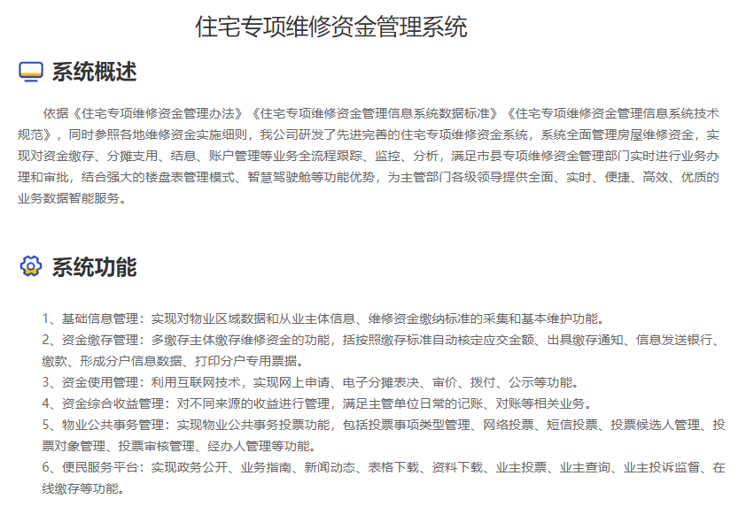
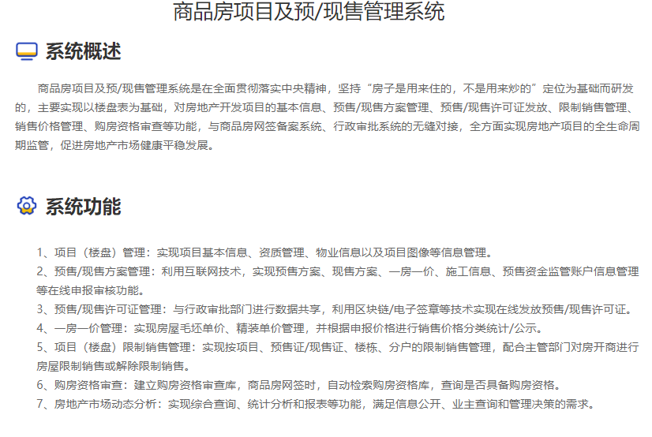
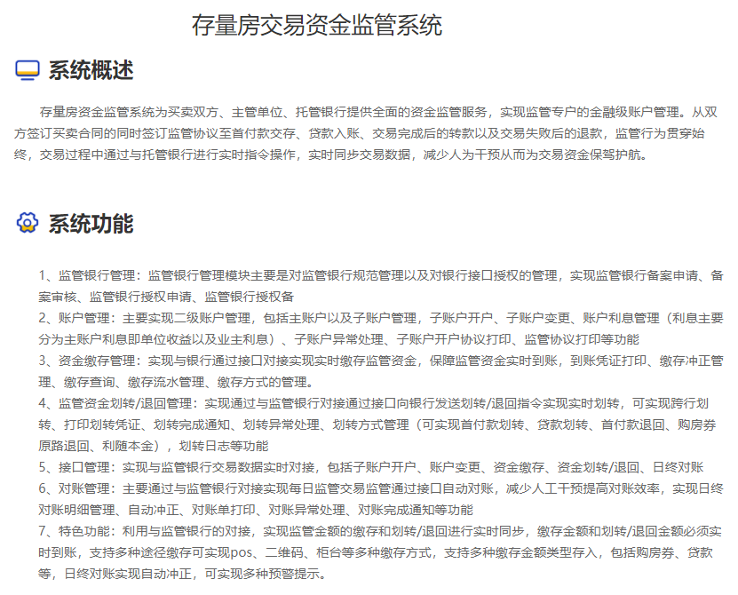
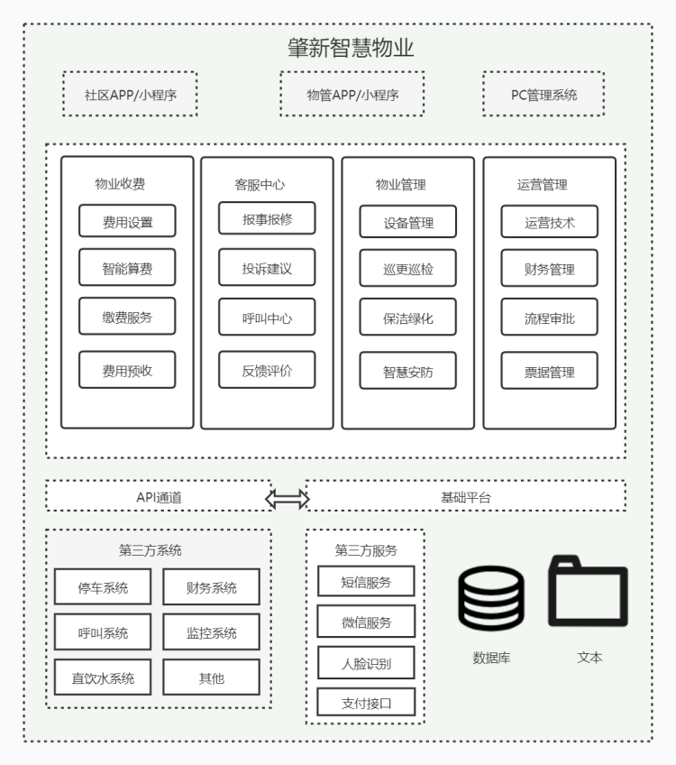

# 资金监管

## 前台业务系统

- 房产测绘及楼盘表管理系统
- 商品房项目及预/现售管理系统
- 新建商品房网签备案管理系统
- 存量房网签备案管理系统
- 从业主体管理系统
- 物业管理系统
- 住房专项维修资金管理系统

## 中台

- 资金账户监管中台
- 支付中台
- 结算中台
- 用户中台
- 票据中台
- 政务共享
- 财会中台

支撑平台

- 注册中心

- 配置中心

- 网关

- 分布式任务调度

- 分布式缓存

- 分布式消息中心

- 监控平台

- 统计分析

- 凭证报表

- 文件中心（档案管理）

- 外联平台

- 住建部统一金融服务平台

系统重构演进：

灰度发布

绞杀式

## 账户中台设计

### 账户中心

### 支付中心

业务系统

- 维修资金监管

- 预售资金监管

- 住房交易资金监管

- 智慧物业

## 支付及结算业务需求分析：

### 1.维修资金系统支付结算需求

- 维修资金交款、退款、项目支用、资金划拨

角色：业主、开发商、维修资金中心

业主缴款：

小程序查询房屋、缴款单扫码下单->调用支付中心下单->支付->到账通知->记账

退款:

商户侧退款

支用：

管理侧资金转账

### 2.物业管理系统支付结算需求

物业系统为SaaS模式，B/S架构，使用平台公有云服务器，单独数据库分区，使用角色为平台合作的付费物业企业，支付结算需求包括：

- 物业费、车位管理费、电梯费等费项需根据后台账单生成支付订单，且用户支付后直接结算至物业企业帐户，不做分成；
- 代收水电费需对接远程水电表设备，用户可在线预充费用，并随时查看余额，用户充值金额结算至物业企业帐户，并定期结算给当地水、电主管部门；
- 业主报修工单支付费用需按照材料费、工时费区分账单，直接结算至物业企业帐户，且平台收取3%的服务费；
- 物业结算金额需满足“T+1”到账，即次日（工作日）到账；
- 所有订单支持后台手动操作退款。

角色：物业服务公司、水利局、电力局、业主、租客、停车访客、维修公司

物业费、车位管理费、电梯费：

业主缴款直接结算到物业企业账户

代收水电费：

### 3.商品房、存量房资金监管系统支付结算需求

- 监管账户划拨资金到开发商账户

角色：监管银行、开发商、住建局

商品房：

预售资金->监管账户

监管账户->开发商

存量房：

买方->监管账户->卖方

### 4.公积金系统支付结算需求

汇缴:

单位批量汇缴->个人公积金账户

个人汇缴

提取：

冲还贷：

步骤一：

维修资金中心、物业公司、开发商开通第三方支付渠道参数，并获取三方支付参数

主要是

| 字段名   | 变量名   | 必填 | 类型       | 示例值                           | 描述                        |
| :------- | :------- | :--- | :--------- | :------------------------------- | :-------------------------- |
| 商户号   | mchNo    | 是   | String(30) | M1621873433953                   | 商户号                      |
| 应用ID   | appId    | 是   | String(24) | 60cc09bce4b0f1c0b83761c9         | 应用ID                      |
| 签名     | sign     | 是   | String(32) | C380BEC2BFD727A4B6845133519F3AD6 | 签名值，详见签名算法        |
| 签名类型 | signType | 是   | String(32) | MD5                              | 签名类型，目前只支持MD5方式 |
| 接口版本 | version  | 是   | String(3)  | 1.0                              | 接口版本号，固定：1.0       |

关键问题：

1.重复下单、支付

2.账务一致性

3.热点账户

4.对账

5.计费

6.结算

7.分层

8.稳定性、流量控制、性能优化

9.资损防控体系、支付监控、风控
